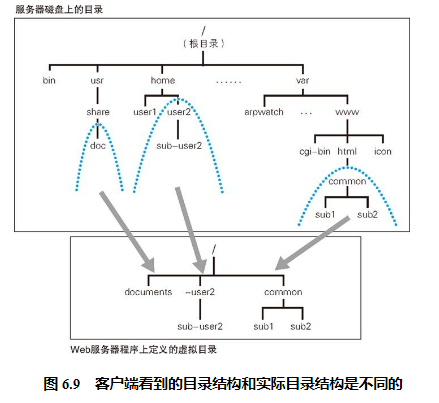
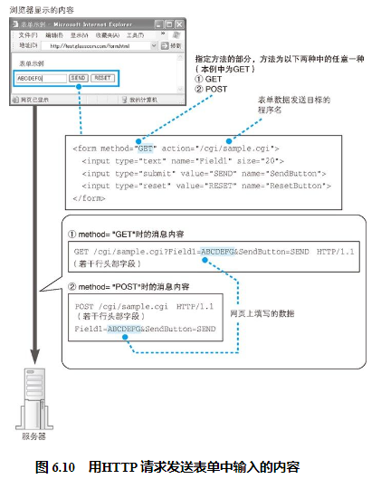

## 将请求的 URI 转换为实际的文件名

服务器程序会根据收到的请求消息中的内容进行相应的处理，并生成响应消息，再通过 write 返回给客户端。请求消息包括一个称为“方法”的命令，以及表示数据源的 URI（文件路径名），服务器程序会根据这些内容向客户端返回数据，但对于不同的方法和 URI，服务器内部的工作过程会有所不同。

不过，按照 URI 从磁盘上读取文件并没有这么简单。如果完全按照 URI 中的路径和文件名读取，那就意味着磁盘上所有的文件都可以访问，Web 服务器的磁盘内容就全部暴露了，这很危险。因此，这里需要一些特殊的机制。

Web 服务器公开的目录其实并不是磁盘上的实际目录，而是如图 6.9 这样的虚拟目录，而 URI 中写的就是在这个虚拟目录结构下的路径名。因此，当读取文件时，需要先查询虚拟目录与实际目录的对应关系，并将 URI 转换成实际的文件名后，才能读取文件并返回数据。

有些 Web 服务器程序还具有文件名改写功能，只要设置好改写的规则，当 URI 中的路径符合改写规则时，就可以将 URI 中的文件名改写成其他的文件名进行访问。当出于某些原因 Web 服务器的目录和文件名发生变化，但又希望用户通过原来的网址进行访问的时候，这个功能非常有用。

## 运行 CGI 程序

如果 URI 指定的文件内容为 HTML 文档或图片，那么只要直接将文件内容作为响应消息返回客户端就可以了。但 URI 指定的文件内容不仅限于 HTML 文档，也有可能是一个程序。在这个情况下，服务器不会直接返回文件内容，而是会运行这个程序，然后将程序输出的数据返回给客户端。

当需要 Web 服务器运行程序时，浏览器发送的 HTTP 请求消息内容会和访问 HTML 文档时不太一样，我们先从这里开始讲。总之，浏览器需要在发送给 Web 服务器的请求消息中加入一些数据。

收到请求消息之后，Web 服务器会进行下面的工作。首先，Web 服务器会检查 URI 指定的文件名，看一看这个文件是不是一个程序。这里的判断方法是在 Web 服务器中事先设置好的，一般是通过文件的扩展名来进行判断，例如将 .cgi、.php 等扩展名的文件设置为程序，当遇到这些文件时，Web 服务器就会将它们作为程序来对待。也可以设置一个存放程序的目录，将这个目录下的所有文件都作为程序来对待。此外，还可以根据文件的属性来进行判断。

如果判断要访问的文件为程序文件，Web 服务器会委托操作系统运行这个程序，然后从请求消息中取出数据并交给运行的程序。如果方法为 GET，则将 URI 后面的参数传递给程序；如果方法为 POST，则将消息体中的数据传递给程序（图 6.11）。

接下来，运行的程序收到数据后会进行一系列处理，并将输出的数据返回给 Web 服务器。程序可以返回各种内容，如表示订单已接受的说明，或者按照关键字从数据库中搜索出的结果等。无论如何，为了将数据处理的结果返回给客户端，首先需要将它返回给 Web 服务器。这些输出的数据一般来说会嵌入到 HTML 文档中，因此 Web 服务器可以直接将其作为响应消息返回给客户端。输出数据的内容是由运行的程序生成的，Web 服务器并不过问，也不会去改变程序输出的内容。

## Web 服务器的访问控制

正如我们前面讲的，Web 服务器的基本工作方式就是根据请求消息的内容判断数据源，并从中获取数据返回给客户端，不过在执行这些操作之前，Web 服务器还可以检查事先设置的一些规则，并根据规则允许或禁止访问。这种根据规则判断是否允许访问的功能称为访问控制，一些会员制的信息服务需要限制用户权限的时候会使用这一功能，公司里也可以利用访问控制只允许某些特定部门访问。

## 返回响应消息