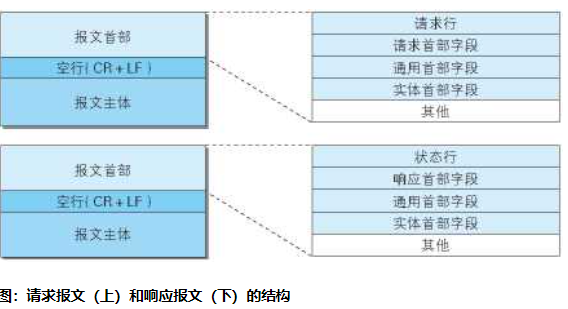

## HTTP 报文

HTTP 报文大致可分为报文首部和报文主体两块。两者由最初出现的空行（CR+LF）来划分。通常，并不一定要有报文主体。

## 请求报文及响应报文结构

请求行

包含用于请求的方法，请求 URI 和 HTTP 版本。

状态行

包含表明响应结果的状态码，原因短语和 HTTP 版本。

首部字段

包含表示请求和响应的各种条件和属性的各类首部。

一般有 4 种首部，分别是：通用首部、请求首部、响应首部和实体首部。

其他

可能包含 HTTP 的 RFC 里未定义的首部（Cookie 等）。

## 编码提升传输速率

HTTP 在传输数据时可以按照数据原貌直接传输，但也可以在传输过程中通过编码提升传输速率。通过在传输时编码，能有效地处理大量的访问请求。但是，编码的操作需要计算机来完成，因此会消耗更多的 CPU 等资源。

### 报文主体和实体主体的差异

报文（message）

是 HTTP 通信中的基本单位，由 8 位组字节流（octet sequence，其中 octet 为 8 个比特）组成，通过 HTTP 通信传输。

实体（entity）

作为请求或响应的有效载荷数据（补充项）被传输，其内容由实体首部和实体主体组成。

HTTP 报文的主体用于传输请求或响应的实体主体。

通常，报文主体等于实体主体。只有当传输中进行编码操作时，实体主体的内容发生变化，才导致它和报文主体产生差异。

### 压缩传输的内容编码

内容编码指明应用在实体内容上的编码格式，并保持实体信息原样压缩。内容编码后的实体由客户端接收并负责解码。

常用的内容编码有以下几种。

gzip（GNU zip）

compress（UNIX 系统的标准压缩）

deflate（zlib）

identity（不进行编码）

### 分割发送的分块传输编码

在 HTTP 通信过程中，请求的编码实体资源尚未全部传输完成之前，浏览器无法显示请求页面。在传输大容量数据时，通过把数据分割成多块，能够让浏览器逐步显示页面。

这种把实体主体分块的功能称为分块传输编码（Chunked Transfer Coding）。

## 发送多种数据的多部分对象集合

相应地，HTTP 协议中也采纳了多部分对象集合，发送的一份报文主体内可含有多类型实体。通常是在图片或文本文件等上传时使用。

在 HTTP 报文中使用多部分对象集合时，需要在首部字段里加上 Content-type。

## 获取部分内容的范围请求

以前，用户不能使用现在这种高速的带宽访问互联网，当时，下载一个尺寸稍大的图片或文件就已经很吃力了。如果下载过程中遇到网络中断的情况，那就必须重头开始。为了解决上述问题，需要一种可恢复的机制。所谓恢复是指能从之前下载中断处恢复下载。

要实现该功能需要指定下载的实体范围。像这样，指定范围发送的请求叫做范围请求（Range Request）。

执行范围请求时，会用到首部字段 Range 来指定资源的 byte 范围。

针对范围请求，响应会返回状态码为 206 Partial Content 的响应报文。另外，对于多重范围的范围请求，响应会在首部字段 Content-Type 标明 multipart/byteranges 后返回响应报文。

如果服务器端无法响应范围请求，则会返回状态码 200 OK 和完整的实体内容。

## 内容协商返回最合适的内容

内容协商机制是指客户端和服务器端就响应的资源内容进行交涉，然后提供给客户端最为适合的资源。内容协商会以响应资源的语言、字符集、编码方式等作为判断的基准。