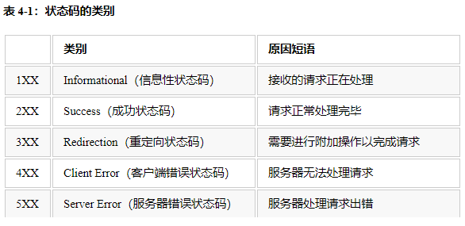

## 状态码告知从服务器端返回的请求结果

状态码的职责是当客户端向服务器端发送请求时，描述返回的请求结果。借助状态码，用户可以知道服务器端是正常处理了请求，还是出现了错误。

## 2XX 成功

**200 OK**
表示从客户端发来的请求在服务器端被正常处理了。
**204 No Content**
该状态码代表服务器接收的请求已成功处理，但在返回的响应报文中不含实体的主体部分。另外，也不允许返回任何实体的主体。一般在只需要从客户端往服务器发送信息，而对客户端不需要发送新信息内容的情况下使用。
**206 Partial Content**
该状态码表示客户端进行了范围请求，而服务器成功执行了这部分的 GET 请求。响应报文中包含由 Content-Range 指定范围的实体内容。

## 3XX 重定向
**301 Moved Permanently**
永久性重定向。该状态码表示请求的资源已被分配了新的 URI，以后应使用资源现在所指的 URI。也就是说，如果已经把资源对应的 URI 保存为书签了，这时应该按 Location 首部字段提示的 URI 重新保存。
**302 Found**
临时性重定向。该状态码表示请求的资源已被分配了新的 URI，希望用户（本次）能使用新的 URI 访问。

和 301 Moved Permanently 状态码相似，但 302 状态码代表的资源不是被永久移动，只是临时性质的。
**303 See Other**
该状态码表示由于请求对应的资源存在着另一个 URI，应使用 GET 方法定向获取请求的资源。

**304 Not Modified**
该状态码表示客户端发送附带条件的请求 2 时，服务器端允许请求访问资源，但未满足条件的情况。304 状态码返回时，不包含任何响应的主体部分。304 虽然被划分在 3XX 类别中，但是和重定向没有关系。

**307 Temporary Redirect**

临时重定向。该状态码与 302 Found 有着相同的含义。尽管 302 标准禁止 POST 变换成 GET，但实际使用时大家并不遵守。

307 会遵照浏览器标准，不会从 POST 变成 GET。但是，对于处理响应时的行为，每种浏览器有可能出现不同的情况。

## 4XX 客户端错误
**400 Bad Request**
该状态码表示请求报文中存在语法错误。当错误发生时，需修改请求的内容后再次发送请求。另外，浏览器会像 200 OK 一样对待该状态码。
**401 Unauthorized**
该状态码表示发送的请求需要有通过 HTTP 认证（BASIC 认证、DIGEST 认证）的认证信息。另外若之前已进行过 1 次请求，则表示用 户认证失败。

返回含有 401 的响应必须包含一个适用于被请求资源的 WWW-Authenticate 首部用以质询（challenge）用户信息。当浏览器初次接收到 401 响应，会弹出认证用的对话窗口。
**403 Forbidden**
该状态码表明对请求资源的访问被服务器拒绝了。服务器端没有必要给出拒绝的详细理由，但如果想作说明的话，可以在实体的主体部分对原因进行描述，这样就能让用户看到了。

未获得文件系统的访问授权，访问权限出现某些问题（从未授权的发送源 IP 地址试图访问）等列举的情况都可能是发生 403 的原因。
**404 Not Found**
该状态码表明服务器上无法找到请求的资源。除此之外，也可以在服务器端拒绝请求且不想说明理由时使用。

## 5XX 服务器错误

**500 Internal Server Error**
该状态码表明服务器端在执行请求时发生了错误。也有可能是 Web 应用存在的 bug 或某些临时的故障。
**503 Service Unavailable**
该状态码表明服务器暂时处于超负载或正在进行停机维护，现在无法处理请求。如果事先得知解除以上状况需要的时间，最好写入 RetryAfter 首部字段再返回给客户端。