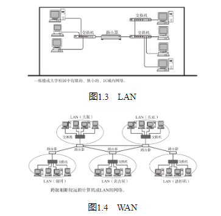

## 计算机的普及与多样化

## 从独立模式到网络互连模式

起初，计算机以单机模式被广泛使用（这种方式也叫独立模式（指计算机未连接到网络，各自独立使用的方式。） ）。然而随着计算机的不断发展，人们已不再局限于单机模式，而是将一个个计算机连接在一起，形成一个计算机网络。

计算机网络，根据其规模可分为WAN（Wide Area Network，广域网）（指覆盖多个远距离区域的远程网络。比广域网再小一级的、连接整个城市的网络叫城域网（MAN，Metropolitan Area Network）。） 和LAN（Local Area Network，局域网）（指一个楼层、一栋楼或一个校园等相对较小的区域内的网络。） 。

## 从计算机通信到信息通信

## 计算机网络的作用
