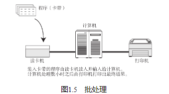
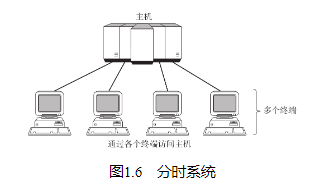
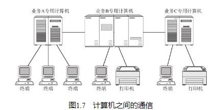
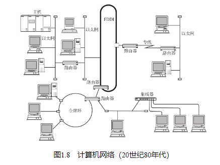
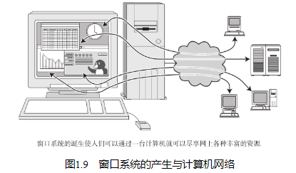

## 批处理

为了能让更多的人使用计算机，出现了批处理（Batch Processing）系统。所谓批处理，是指事先将用户程序和数据装入卡带或磁带，并由计算机按照一定的顺序读取，使用户所要执行的这些程序和数据能够一并批量得到处理的方式。

## 分时系统

然而分时系统的产生则实现了“一人一机”的目的，让用户感觉就好像“完全是自己在使用一台计算机一样”。这也体现了分时系统的一个重要特性——独占性。

由于分时系统的独占性，使得装备一套用户可直接操作的计算机环境变得比以前简单。分时系统中每个终端与计算机之间使用通信线路连接形成一个星形（中心有一台计算机，周围连接着众多终端，形似星形（*）。） 结构。正是从这一时期开始，网络（通信）与计算机之间的关系逐渐浮出水面。小型机也随即产生，办公场所与工厂也逐渐引入计算机。

## 计算机之间的通信

如图1.7可见在分时系统中，计算机与每个终端之间用通信线路连接，这并不意味着计算机与计算机之间也已相互连接。

计算机间的通信显著地提高了计算机的可用性。人们不再局限于仅使用一台计算机进行处理，而是逐渐使用多台计算机分布式处理，最终一并得到返回结果。

## 计算机网络的产生

## 互联网的普及

## 以互联网技术为中心的时代

## 从“单纯建立连接”到“安全建立连接”

