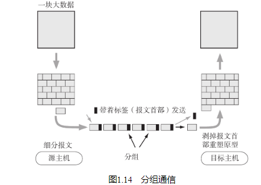

## 协议的必要性

简单来说，协议就是计算机与计算机之间通过网络实现通信时事先达成的一种“约定”。这种“约定”使那些由不同厂商的设备、不同的CPU以及不同的操作系统组成的计算机之间，只要遵循相同的协议就能够实现通信。反之，如果所使用的协议不同，就无法实现通信。

## 分组交换协议

分组交换是指将大数据分割为一个个叫做包（Packet）的较小单位进行传输的方法。

当人们邮寄包裹时，通常会填写一个寄件单贴到包裹上再交给邮局。寄件单上一般会有寄件人和收件人的详细地址。类似地，计算机通信也会在每一个分组中附加上源主机地址和目标主机地址送给通信线路。这些发送端地址、接收端地址以及分组序号写入的部分称为“报文首部”。

一个较大的数据被分为多个分组时，为了标明是原始数据中的哪一部分，就有必要将分组的序号写入包中。接收端会根据这个序号，再将每个分组按照序号重新装配为原始数据。

