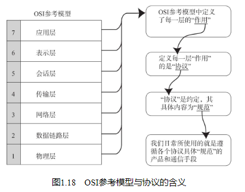

## 协议的分层

在这一模型中，每个分层都接收由它下一层所提供的特定服务，并且负责为自己的上一层提供特定的服务。上下层之间进行交互时所遵循的约定叫做“接口”。同一层之间的交互所遵循的约定叫做“协议”。

协议分层就如同计算机软件中的模块化开发。OSI参考模型的建议是比较理想化的。它希望实现从第一层到第七层的所有模块，并将它们组合起来实现网络通信。分层可以将每个分层独立使用，即使系统中某些分层发生变化，也不会波及整个系统。因此，可以构造一个扩展性和灵活性都较强的系统。此外，通过分层能够细分通信功能，更易于单独实现每个分层的协议，并界定各个分层的具体责任和义务。这些都属于分层的优点。

而分层的劣势，可能就在于过分模块化、使处理变得更加沉重以及每个模块都不得不实现相似的处理逻辑等问题。

## OSI参考模型

## OSI参考模型中各个分层的作用

应用层

为应用程序提供服务并规定应用程序中通信相关的细节。包括文件传输、电子邮件、远程登录（虚拟终端）等协议。

表示层

将应用处理的信息转换为适合网络传输的格式，或将来自下一层的数据转换为上层能够处理的格式。因此它主要负责数据格式的转换。

会话层

负责建立和断开通信连接（数据流动的逻辑通路），以及数据的分割等数据传输相关的管理。

传输层

起着可靠传输的作用。只在通信双方节点上进行处理，而无需在路由器上处理。

网络层

将数据传输到目标地址。目标地址可以是多个网络通过路由器连接而成的某一个地址。因此这一层主要负责寻址和路由选择。

数据链路层

负责物理层面上互连的、节点之间的通信传输。例如与1个以太网相连的2个节点之间的通信。

将0、1序列划分为具有意义的数据帧传送给对端（数据帧的生成与接收）。

物理层

负责0、1比特流（0、1序列）与电压的高低、光的闪灭之间的互换。

