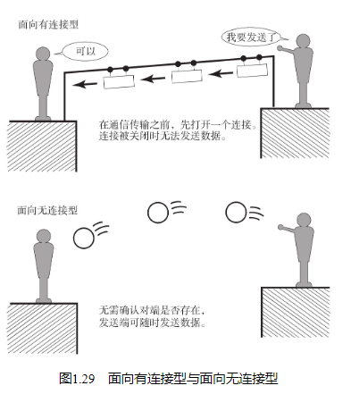
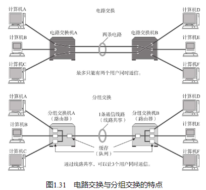
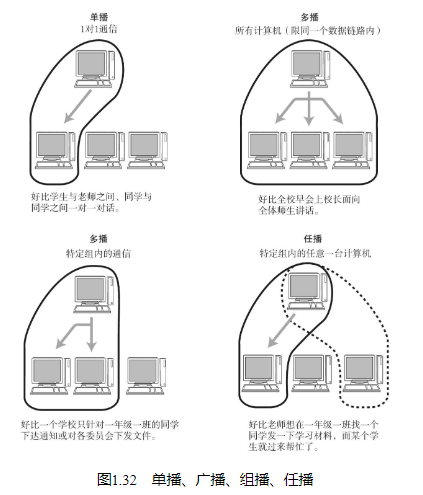

## 面向有连接型与面向无连接型

## 电路交换与分组交换

在电路交换中，交换机主要负责数据的中转处理。计算机首先被连接到交换机上，而交换机与交换机之间则由众多通信线路再继续连接。因此计算机之间在发送数据时，需要通过交换机与目标主机建立通信电路。我们将连接电路称为建立连接。建立好连接以后，用户就可以一直使用这条电路，直到该连接被断开为止。

如果某条电路只是用来连接两台计算机的通信线路，就意味着只需在这两台计算机之间实现通信，因此这两台计算机是可以独占线路进行数据传输的。但是，如果一条电路上连接了多台计算机，而这些计算机之间需要相互传递数据，就会出现新的问题。鉴于一台计算机在收发信息时会独占整个电路，其他计算机只能等待这台计算机处理结束以后才有机会使用这条电路收发数据。并且在此过程中，谁也无法预测某一台计算机的数据传输从何时开始又在何时结束。如果并发用户数超过交换机之间的通信线路数，就意味着通信根本无法实现。

为此，人们想到了一个新的方法，即让连接到通信电路的计算机将所要发送的数据分成多个数据包，按照一定的顺序排列之后分别发送。这就是分组交换。有了分组交换，数据被细分后，所有的计算机就可以一齐收发数据，这样也就提高了通信线路的利用率。由于在分组的过程中，已经在每个分组的首部写入了发送端和接收端的地址，所以即使同一条线路同时为多个用户提供服务，也可以明确区分每个分组数据发往的目的地，以及它是与哪台计算机进行的通信。

在分组交换中，由分组交换机（路由器）连接通信线路。分组交换的大致处理过程是：发送端计算机将数据分组发送给路由器，路由器收到这些分组数据以后，缓存到自己的缓冲区，然后再转发给目标计算机。因此，分组交换也有另一个名称：蓄积交换。

## 根据接收端数量分类

单播（Unicast）

字面上，“Uni”表示“1”，“Cast”意为“投掷”。组合起来就是指1对1通信。早先的固定电话就是单播通信的一个典型例子。

广播（Broadcast）

字面上具有“播放”之意。因此它指是将消息从1台主机发送给与之相连的所有其他主机。广播通信（关于TCP/IP中的广播通信请参考4.3.4节。） 的一个典型例子就是电视播放，它将电视信号一齐发送给非特定的多个接收对象。

多播（Multicast）

多播与广播类似，也是将消息发给多个接收主机。不同之处在于多播要限定某一组主机作为接收端。多播通信（关于TCP/IP中的多播通信请参考4.3.5节。） 最典型的例子就是电视会议，这是由多组人在不同的地方参加的一种远程会议。在这种形式下，会由一台主机发送消息给特定的多台主机。电视会议通常不能使用广播方式。否则将无从掌握是谁在哪儿参与电视会议。

任播（Anycast）

任播是指在特定的多台主机中选出一台作为接收端的一种通信方式。虽然，这种方式与多播有相似之处，都是面向特定的一群主机，但是它的行为却与多播不同。任播通信（关于TCP/IP中的任播通信请参考5.2.8节。） 从目标主机群中选择一台最符合网络条件的主机作为目标主机发送消息。通常，所被选中的那台特定主机将返回一个单播信号，随后发送端主机会只跟这台主机进行通信。