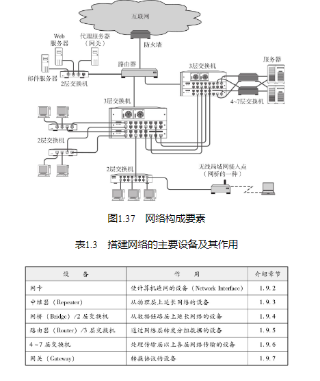
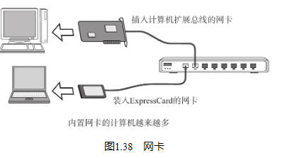
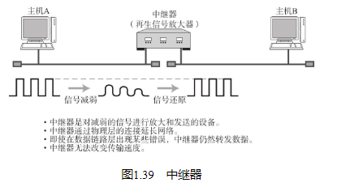
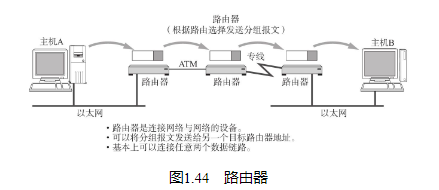
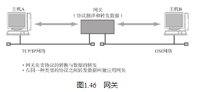

## 通信媒介与数据链路

计算机之间通过电缆相互连接。电缆可以分为很多种，包括双绞线电缆、光纤电缆、同轴电缆、串行电缆等。根据数据链路（Datalink，意指相互直连的设备之间进行通信所涉及的协议及其网络。为此，有众多传输介质与之对应。具体细节可参考第3章。） 的不同选用的电缆类型也不尽相同。

## 网卡

任何一台计算机连接网络时，必须要使用网卡（全称为网络接口卡）。网络接口卡（NIC（集成了连接局域网功能的设备。有时会被集成到计算机的主板中，有时也可以单独插入扩展槽使用。Network Information Center的缩写也是NIC，所以要注意区分。） ）有时也被叫做网络适配器、网卡、LAN卡。

## 中继器

中继器（Repeater）是在OSI模型的第1层——物理层面上延长网络的设备。由电缆传过来的电信号或光信号经由中继器的波形调整和放大再传给另一个电缆。

一般情况下，中继器的两端连接的是相同的通信媒介，但有的中继器也可以完成不同媒介之间的转接工作。例如，可以在同轴电缆与光缆之间调整信号。然而，在这种情况下，中继器也只是单纯负责信号在0和1比特流之间的替换，并不负责判断数据是否有错误。同时，它只负责将电信号转换为光信号，因此不能在传输速度不同的媒介之间转发（用中继器无法连接一个100Mbps的以太网和另一个10Mbps的以太网。连接两个不同速度的网络需要的是网桥或路由器这样的设备。） 。

## 网桥/2层交换机

网桥是在OSI模型的第2层——数据链路层面上连接两个网络的设备。它能够识别数据链路层中的数据帧（与分组数据意思大致相同，但是在数据链路层中通常习惯称为帧。具体可参考2.5.1节。） ，并将这些数据帧临时存储于内存，再重新生成信号作为一个全新的帧转发给相连的另一个网段（具有分割、划分网络之意，详细内容可参考3.1节。此外，在TCP中也可以表示数据。具体可参考2.5.1节的专栏。） 。由于能够存储这些数据帧，网桥能够连接10BASE-T与100BASE-TX等传输速率完全不同的数据链路，并且不限制连接网段的个数。

数据链路的数据帧中有一个数据位叫做FCS（用CRC（Cyclic Redundancy Check，循环冗余校验码）方式校验数据帧中的位。有时由于噪音导致通信传输当中数据信号越来越弱，而这种CRC正是用来检查数据帧是否因此而受到破坏的。） ，用以校验数据是否正确送达目的地。网桥通过检查这个域中的值，将那些损坏的数据丢弃，从而避免发送给其他的网段。此外，网桥还能通过地址自学机制和过滤功能控制网络流量（网络上传输的数据报文的数量。） 。

## 路由器/3层交换机

路由器是在OSI模型的第3层——网络层面上连接两个网络、并对分组报文进行转发的设备。网桥是根据物理地址（MAC地址）进行处理，而路由器/3层交换机则是根据IP地址进行处理的。由此，TCP/IP中网络层的地址就成为了IP地址。

路由器可以连接不同的数据链路。例如连接两个以太网，或者连接一个以太网与一个FDDI。现在，人们在家或办公室里连接互联网时所使用的宽带路由器也是路由器的一种。

## 4～7层交换机

## 网关

它与4～7层交换机一样都是处理传输层及以上的数据，但是网关不仅转发数据还负责对数据进行转换，它通常会使用一个表示层或应用层网关，在两个不能进行直接通信的协议之间进行翻译，最终实现两者之间的通信。