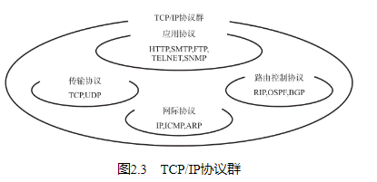

## 从军用技术的应用谈起

## ARPANET的诞生

## TCP/IP的诞生

## UNIX系统的普及与互联网的扩张

## 商用互联网服务的启蒙

## TCP/IP的标准化

## TCP/IP的具体含义

从字面意义上讲，有人可能会认为TCP/IP是指TCP与IP两种协议。实际生活当中有时也确实就是指这两种协议。然而在很多情况下，它只是利用IP进行通信时所必须用到的协议群的统称。具体来说，IP或ICMP、TCP或UDP、TELNET或FTP、以及HTTP等都属于TCP/IP的协议。它们与TCP或IP的关系紧密，是互联网必不可少的组成部分。TCP/IP一词泛指这些协议，因此，有时也称TCP/IP为网际协议族（网际协议族（Internet Protocol Suite）：组成网际协议的一组协议。） 。

## TCP/IP标准化精髓

TCP/IP的协议的标准化过程与其他的标准化过程有所不同，具有两大特点：一是具有开放性，二是注重实用性，即被标准化的协议能否被实际运用。

## TCP/IP规范——RFC

## TCP/IP规范——RFC