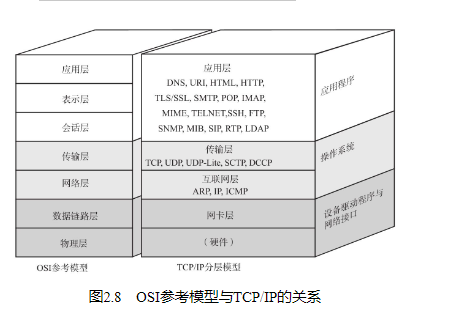
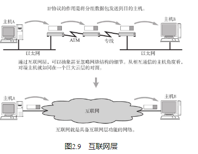

## TCP/IP与OSI参考模型

## 硬件（物理层）

TCP/IP的最底层是负责数据传输的硬件。这种硬件就相当于以太网或电话线路等物理层的设备。

## 网络接口层（数据链路层）

网络接口层（有时人们也将网络接口层与硬件层合并起来称作网络通信层。） 利用以太网中的数据链路层进行通信，因此属于接口层。也就是说，把它当做让NIC起作用的“驱动程序”也无妨。驱动程序是在操作系统与硬件之间起桥梁作用的软件。计算机的外围附加设备或扩展卡，不是直接插到电脑上或电脑的扩展槽上就能马上使用的，还需要有相应驱动程序的支持。例如换了一个新的NIC网卡，不仅需要硬件，还需要软件才能真正投入使用。

## 互联网层（网络层）

TCP/IP分层中的互联网层与传输层的功能通常由操作系统提供。尤其是路由器，它必须得实现通过互联网层转发分组数据包的功能。

此外，连接互联网的所有主机跟路由器必须都实现IP的功能。其他连接互联网的网络设备（如网桥、中继器或集线器）就没必要一定实现IP或TCP的功能（有时为了监控和管理网桥、中继器、集线器等设备，也需要让它们具备IP、TCP的功能。） 。

## 传输层

传输层最主要的功能就是能够让应用程序之间实现通信。计算机内部，通常同一时间运行着多个程序。为此，必须分清是哪些程序与哪些程序在进行通信。识别这些应用程序的是端口号。

## 应用层（会话层以上的分层）