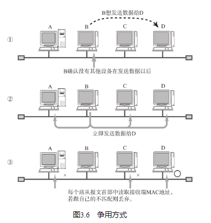
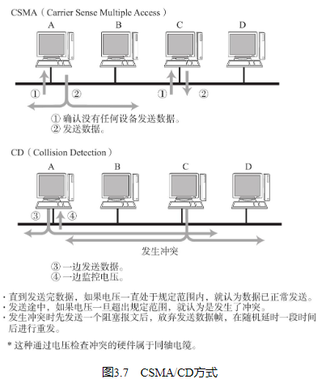
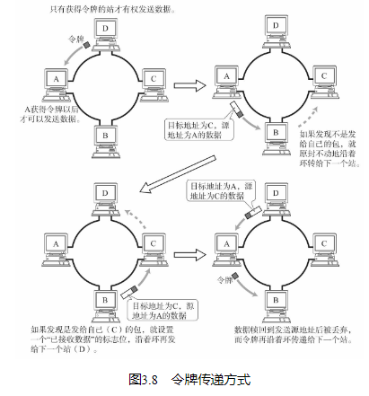
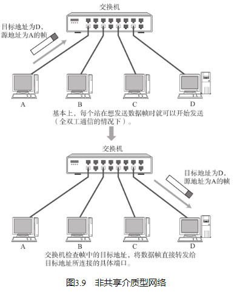
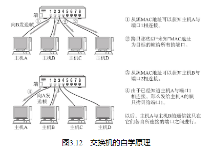
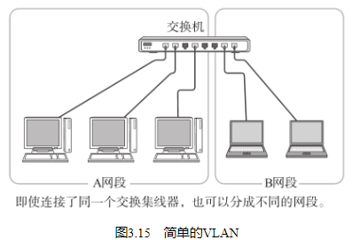
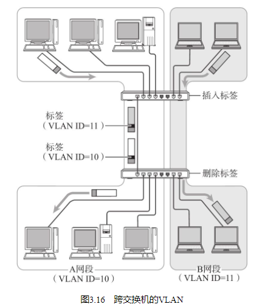

## MAC地址

MAC地址用于识别数据链路中互连的节点（如图3.4）。以太网或FDDI中，根据IEEE802.3（IEEE指的是美国电气和电子工程师协会，也叫“I triple E”。IEEE802是制定局域网标准化相关规范的组织。其中IEEE802.3是关于以太网（CSMA/CD）的国际规范。） 的规范使用MAC地址。其他诸如无线LAN（IEEE802.11a/b/g/n等）、蓝牙等设备中也是用相同规格的MAC地址。

MAC地址长48比特，结构如图3.5所示。在使用网卡（NIC）的情况下，MAC地址一般会被烧入到ROM中。因此，任何一个网卡的MAC地址都是唯一的，在全世界都不会有重复（也有例外，具体请参考后页注解。）

MAC地址中3～24位（比特位）表示厂商识别码，每个NIC厂商都有特定唯一的识别数字。25～48位是厂商内部为识别每个网卡而用。因此，可以保证全世界不会有相同MAC地址的网卡。

在全世界，MAC地址也并不总是唯一的。实际上，即使MAC地址相同，只要不是同属一个数据链路就不会出现问题。

## 共享介质型网络

从通信介质（通信，介质）的使用方法上看，网络可分为共享介质型和非共享介质型。

共享介质型网络指由多个设备共享一个通信介质的一种网络。最早的以太网和FDDI就是介质共享型网络。在这种方式下，设备之间使用同一个载波信道进行发送和接收。为此，基本上采用半双工通信（参考3.2.3节后面的详解）方式，并有必要对介质进行访问控制。

共享介质型网络中有两种介质访问控制方式：一种是争用方式，另一种是令牌传递方式。

### 争用方式

争用方式（Contention）是指争夺获取数据传输的权力，也叫CSMA（载波监听多路访问）。这种方法通常令网络中的各个站（数据链路中很多情况下称节点为“站”。） 采用先到先得的方式占用信道发送数据，如果多个站同时发送帧，则会产生冲突现象。也因此会导致网络拥堵与性能下降。

在一部分以太网当中，采用了改良CSMA的另一种方式——CSMA/CD（Carrier Sense Multiple Access with Collision Detection） 方式。CSMA/CD要求每个站提前检查冲突，一旦发生冲突，则尽早释放信道。其具体工作原理如下：

如果载波信道上没有数据流动，则任何站都可以发送数据。
检查是否会发生冲突。一旦发生冲突时，放弃发送数据（实际上会发送一个32位特别的信号，在阻塞报文以后再停止发送。接收端通过发生冲突时帧的FCS（参考3.3.4节），判断出该帧不正确从而丢弃帧。） ，同时立即释放载波信道。
放弃发送以后，随机延时一段时间，再重新争用介质，重新发送帧。

### 令牌传递方式

令牌传递方式是沿着令牌环发送一种叫做“令牌”的特殊报文，是控制传输的一种方式。只有获得令牌的站才能发送数据。这种方式有两个特点：一是不会有冲突，二是每个站都有通过平等循环获得令牌的机会。因此，即使网络拥堵也不会导致性能下降。

当然，这种方式中，一个站在没有收到令牌前不能发送数据帧，因此在网络不太拥堵的情况下数据链路的利用率也就达不到100％。为此，衍生了多种令牌传递的技术。例如，早期令牌释放、令牌追加（不等待接收方的数据到达确认就将令牌发送给下一个站。） 等方式以及多个令牌同时循环等方式。这些方式的目的都是为了尽可能地提高网络性能。

## 非共享介质网络

非共享介质网络是指不共享介质，是对介质采取专用的一种传输控制方式。在这种方式下，网络中的每个站直连交换机，由交换机负责转发数据帧。此方式下，发送端与接收端并不共享通信介质，因此很多情况下采用全双工通信方式（具体请参考本节最后的详解）。

该方式还可以根据交换机的高级特性构建虚拟局域网（VLAN，Virtual LAN）（关于VLAN的更多细节请参考3.2.6节。） 、进行流量控制等。当然，这种方式也有一个致命的弱点，那就是一旦交换机发生故障，与之相连的所有计算机之间都将无法通信。

## 半双工与全双工通信

半双工是指，只发送或只接收的通信方式。它类似于无线电收发器，若两端同时说话，是听不见对方说的话的。而全双工不同，它允许在同一时间既可以发送数据也可以接收数据。类似于电话，接打双方可以同时说话。

## 根据MAC地址转发

在使用同轴电缆的以太网（10BASE5、10BASE2）等介质共享网络中，同一时间只能有一台主机发送数据。当连网的主机数量增加时，通信性能会明显下降。若将集线器或集中器等设备以星型连接，就出现了一款新的网络设备——交换集线器，这是一种将非介质共享型网络中所使用的交换机用在以太网中的技术，交换集线器也叫做以太网交换机。

以太网交换机就是持有多个端口（计算机设备的外部接口都称做端口。必须注意TCP或UDP等传输层协议中的“端口”另有其他含义。） 的网桥。它们根据数据链路层中每个帧的目标MAC地址，决定从哪个网络接口发送数据。这时所参考的、用以记录发送接口的表就叫做转发表（Forwarding Table）。

由于MAC地址没有层次性（关于地址的层次性，请参考1.8.2节。） ，转发表中的入口个数与整个数据链路中所有网络设备的数量有关。当设备数量增加时，转发表也会随之变大，检索转发表所用的时间也就越来越长。当连接多个终端时，有必要将网络分成多个数据链路，采用类似于网络层的IP地址一样对地址进行分层管理。

## 环路检测技术

为此，有必要解决网络中的环路问题。具体有生成树与源路由两种方式。如果使用具有这些功能的网桥，那么即使构建了一个带有环路的网络，也不会造成那么严重的问题。只要搭建合适的环路，就能分散网络流量，在发生某一处路由故障时选择绕行，可以提高容灾能力。

### 生成树方式
该方法由IEEE802.1D定义。每个网桥必须在每1～10秒内相互交换BPDU（Bridge Protocol Data Unit）包，从而判断哪些端口使用哪些不使用，以便消除环路。一旦发生故障，则自动切换通信线路，利用那些没有被使用的端口继续进行传输。
### 源路由法
源路由法最早由IBM提出，以解决令牌环（关于Token Ring的更多细节，请参考3.6.4节。） 网络的问题。该方式可以判断发送数据的源地址是通过哪个网桥实现传输的，并将帧写入RIF（Routing Information Field）。网桥则根据这个RIF信息发送帧给目标地址。因此，即使网桥中出现了环路，数据帧也不会被反复转发，可成功地发送到目标地址。在这种机制中发送端本身必须具备源路由的功能。

## VLAN

行网络管理的时候，时常会遇到分散网络负载、变换部署网络设备的位置等情况。而有时管理员在做这些操作时，不得不修改网络的拓扑结构，这也就意味着必须进行硬件线路的改造。然而，如果采用带有VLAN技术的网桥，就不用实际修改网络布线，只需修改网络的结构即可。

