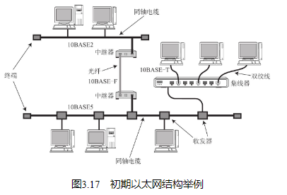
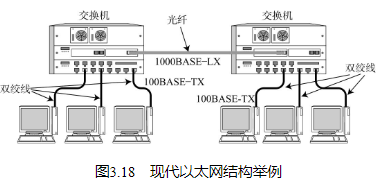
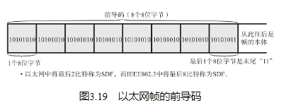
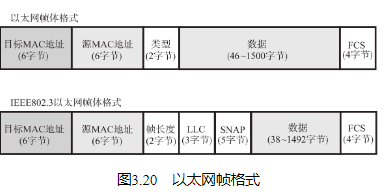

## 以太网连接形式

在以太网普及之初，一般采用多台终端使用同一根同轴电缆的共享介质型连接方式。

而现在，随着互连设备的处理能力以及传输速度的提高，一般都采用终端与交换机之间独占电缆的方式实现以太网通信，如图3.18。

## 以太网的分类

## 以太网的历史

## 以太网帧格式

以太网帧前端有一个叫做前导码（Preamble）的部分，它由0、1数字交替组合而成，表示一个以太网帧的开始，也是对端网卡能够确保与其同步的标志。如图3.19所示。前导码末尾是一个叫做SFD（Start Frame Delimiter）的域，它的值是“11”。在这个域之后就是以太网帧的本体（图3.20）。前导码与SFD合起来占8个字节（8位字节（octet）指包含8比特的1个字节。与人们平常说的字节（Byte）类似。关于它们的更多细节请参考后面的内容。） 。

以太网帧本体的前端是以太网的首部，它总共占14个字节。分别是6个字节的目标MAC地址、6个字节的源MAC地址以及2个字节的上层协议类型。

紧随帧头后面的是数据。一个数据帧所能容纳的最大数据范围是46～1500个字节。帧尾是一个叫做FCS（Frame Check Sequence，帧检验序列）的4个字节。

在目标MAC地址中存放了目标工作站的物理地址。源MAC地址中则存放构造以太网帧的发送端工作站的物理地址。

帧尾最后出现的是FCS（Frame Check Sequence） 。用它可以检查帧是否有所损坏。在通信传输过程中如果出现电子噪声的干扰，可能会影响发送数据导致乱码位的出现。因此，通过检查这个FCS字段的值可以将那些受到噪声干扰的错误帧丢弃。

FCS中保存着整个帧除以生成多项式的余数（只是这时计算余数时，除了减法还会使用异或运算。） 。在接收端也用同样的方式计算，如果得到FCS的值相同，就判定所接收的帧没有差错（FCS具有较强的检错能力，能够检测出大量突发错误。） 。