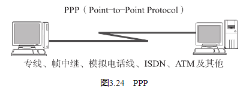
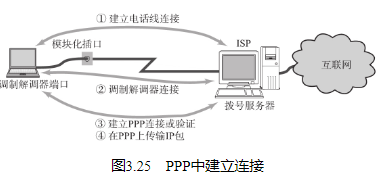
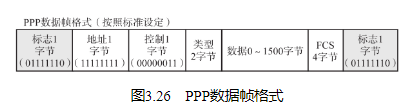
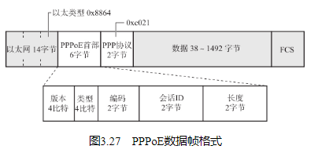

## PPP定义

PPP（Point-to-Point Protocol）是指点对点，即1对1连接计算机的协议。PPP相当于位于OSI参考模型第2层的数据链路层。

## LCP与NCP

在开始进行数据传输前，要先建立一个PPP级的连接（在使用电话线的情况下，首先要保证电话线物理层面的连接以后才能在它之上建立PPP连接。） 。当这个连接建立以后就可以进行身份认证、压缩与加密。

在PPP的主要功能中包括两个协议：一个是不依赖上层的LCP协议（Link Control Protocol），另一个是依赖上层的NCP协议（Network Control Protocol）。如果上层为IP，此时的NCP也叫做IPCP（IP Control Protocol）。

LCP主要负责建立和断开连接、设置最大接收单元（MRU，Maximum Receive Unit）、设置验证协议（PAP或CHAP）以及设置是否进行通信质量的监控。

而IPCP则负责IP地址设置以及是否进行TCP/IP首部压缩等设备（设备之间的这种交互也叫协商（Negotiation）。） 。

通过PPP连接时，通常需要进行用户名密码的验证，并且对通信两端进行双方向的验证（通过ISP接入互联网时，一般对ISP端不验证。） 。其验证协议有两种，分别为PAP（Password Authentication Protocol）和CHAP（Challenge Handshake Authentication Protocol）。

PAP是PPP连接建立时，通过两次握手进行用户名和密码验证。其中密码以明文方式传输。因此一般用于安全要求并不很高的环境，否则会有窃听或盗用连接的危险。

CHAP则使用一次性密码OTP（One Time Password），可以有效防止窃听。此外，在建立连接后还可以进行定期的密码交换，用来检验对端是否中途被替换。

## PPP的帧格式

PPP的数据帧格式如图3.26所示。其中标志码用来区分每个帧。这一点与HDLC（HDLC High Level Data Link Control Procedure，高级数据链路控制。） 协议非常相似，因为PPP本身就是基于HDLC制定出来的一种协议。

## PPPoE

