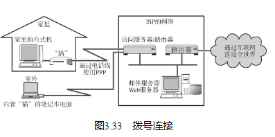
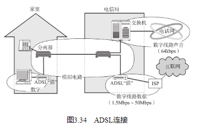

## 模拟电话线路

模拟电话线路其实就是利用固定电话线路进行通信。电话线中的音频带宽用于拨号上网。该方法不需要特殊的通信线路，完全使用已普及的电话网。

让计算机与电话线相连需要有一个将数字信号转换为模拟信号的调制解调器（俗称“猫”）。“猫”的传输速率一般只在56kbps左右，所以现在已逐渐被淘汰。

## 移动通信服务

## ADSL

ADSL正是利用话机到电信局交换机之间这段线路，附加一个叫做分离器的装置，将音频信号（低频信号）和数字信号（高频信号）隔离以免产生噪声干扰。

类似这种类型的通信方式除了ADSL还有其他诸如VDSL、HDSL、SDSL等。它们被统称为xDSL。ADSL是其中最为普及的一种方式。

## FTTH

TTH（Fiber To The Home）顾名思义就是一根高速光纤直接连到用户家里或公司建筑物处的方法。它通过一个叫做ONU（Optical Network Unit，光网络单元。其局端光线路终端叫做OLT（Optical Line Terminal）。） 的装置将计算机与之关连。该装置负责在光信号与电子信号之间的转换。使用FTTH可以实现稳定的高速通信。不过它的线路传输速率与具体的服务内容仍受个别运营商限制。

## 有线电视

## 公共无线LAN