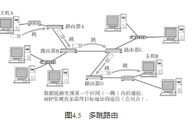
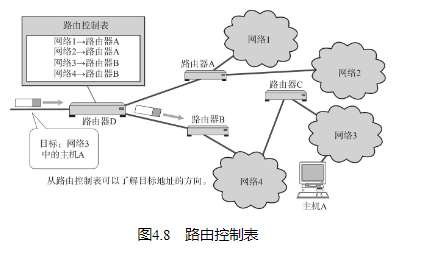

IP大致分为三大作用模块，它们是IP寻址、路由（最终节点为止的转发）以及IP分包与组包。以下就这三个要点逐一介绍。

## IP地址属于网络层地址

## 路由控制

### 发送数据至最终目标地址
Hop译为中文叫“跳”。它是指网络中的一个区间。IP包正是在网络中一个个跳间被转发。因此IP路由也叫做多跳路由。在每一个区间内决定着包在下一跳被转发的路径。

### 路由控制表

## 数据链路的抽象化

不同数据链路有个最大的区别，就是它们各自的最大传输单位（MTU：Maximum Transmission Unit）不同。就好像人们在邮寄包裹或行李时有各自的大小限制一样。

为了解决这个问题，IP进行分片处理（IP Fragmentation）。顾名思义，所谓分片处理是指，将较大的IP包分成多个较小的IP包（关于分片处理的更多细节，请参考4.5节。） 。分片的包到了对端目标地址以后会再被组合起来传给上一层。即从IP的上次层看，它完全可以忽略数据包在途中的各个数据链路上的MTU，而只需要按照源地址发送的长度接收数据包。IP就是以这种方式抽象化了数据链路层，使得从上层更不容易看到底层网络构造的细节。

## IP属于面向无连接型

那么，为什么IP要采用面向无连接呢？

主要有两点原因：一是为了简化，二是为了提速。面向连接比起面向无连接处理相对复杂。甚至管理每个连接本身就是一个相当繁琐的事情。此外，每次通信之前都要事先建立连接，又会降低处理速度。需要有连接时，可以委托上一层提供此项服务。因此，IP为了实现简单化与高速化采用面向无连接的方式。