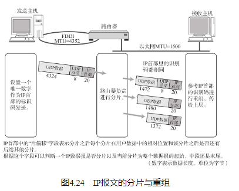

## 数据链路不同，MTU则相异

## IP报文的分片与重组

经过分片之后的IP数据报在被重组的时候，只能由目标主机进行。路由器虽然做分片但不会进行重组。

这样的处理是由诸多方面的因素造成的。例如，现实当中无法保证IP数据报是否经由同一个路径传送。因此，途中即使等待片刻，数据包也有可能无法到达目的地。此外，拆分之后的每个分片也有可能会在途中丢失（在目标主机上进行分片的重组时，可能有一部分包会延迟到达。因此，一般会从第一个数据报的分片到达的那一刻起等待约30秒再进行处理。） 。即使在途中某一处被重新组装，但如果下一站再经过其他路由时还会面临被分片的可能。这会给路由器带来多余的负担，也会降低网络传送效率。出于这些原因，在终结点（目标主机）端重组分片了的IP数据报成为现行的规范。

## 路径MTU发现

分片机制也有它的不足。首先，路由器的处理负荷加重。随着时代的变迁，计算机网络的物理传输速度不断上升。这些高速的链路，对路由器和计算机网络提出了更高的要求。另一方面，随着人们对网络安全的要求提高，路由器需要做的其他处理也越来越多，如网络过滤（过滤是指只有带有一定特殊参数的IP数据报才能通过路由器。这里的参数可以是发送端主机、接收端主机、TCP或UDP端口号或者TCP的SYN标志或ACK标志等。） 等。因此，只要允许，是不希望由路由器进行IP数据包的分片处理的。

其次，在分片处理中，一旦某个分片丢失，则会造成整个IP数据报作废。为了避免此类问题，TCP的初期设计还曾使用过更小（包含TCP的数据限制在536字节或512字节。） 的分片进行传输。其结果是网路的利用率明显下降。

为了应对以上问题，产生了一种新的技术“路径MTU发现”（Path MTU Discovery（也可以缩写为PMTUD。） ）。所谓路径MTU（Path MTU）是指从发送端主机到接收端主机之间不需要分片时最大MTU的大小。即路径中存在的所有数据链路中最小的MTU。而路径MTU发现从发送主机按照路径MTU的大小将数据报分片后进行发送。进行路径MTU发现，就可以避免在中途的路由器上进行分片处理，也可以在TCP中发送更大的包。现在，很多操作系统都已经实现了路径MTU发现的功能。