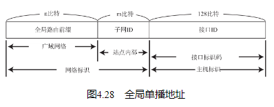
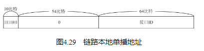

## IPv6的必要性

从IPv4切换到IPv6极其耗时，需要将网络中所有主机和路由器的IP地址进行重新设置。当互联网广泛普及后，替换所有IP地址会是更为艰巨的任务。

也是出于上述原因，IPv6不仅仅能解决IPv4地址耗尽的问题，它甚至试图弥补IPv4中的绝大多数缺陷。目前，人们正着力于进行IPv4与IPv6之间的相互通信与兼容性方面的测试（即IP隧道（5.7节）和协议转换（5.6.3节）等。） 。

## IPv6的特点

IP地址的扩大与路由控制表的聚合
IP地址依然适应互联网分层构造。分配与其地址结构相适应的IP地址，尽可能避免路由表膨大。

性能提升
包首部长度采用固定的值（40字节），不再采用首部检验码。简化首部结构，减轻路由器负荷。路由器不再做分片处理（通过路径MTU发现只由发送端主机进行分片处理）。

支持即插即用功能
即使没有DHCP服务器也可以实现自动分配IP地址。

采用认证与加密功能
应对伪造IP地址的网络安全功能以及防止线路窃听的功能（IPsec）。

多播、Mobile IP成为扩展功能
多播和Mobile IP被定义为IPv6的扩展功能。由此可以预期，曾在IPv4中难于应用的这两个功能在IPv6中能够顺利使用。

## IPv6中IP地址的标记方法

## IPv6地址的结构

## 全局单播地址

全局单播地址是指世界上唯一的一个地址。它是互联网通信以及各个域内部通信中最为常用的一个IPv6地址。

全局单播地址的格式如图4.28所示。现在IPv6的网络中所使用的格式为，n=48，m=16以及128-n-m=64。即前64比特为网络标识，后64比特为主机标识。

## 链路本地单播地址

链路本地单播地址是指在同一个数据链路内唯一的地址。它用于不经过路由器，在同一个链路中的通信。通常接口ID保存64比特版的MAC地址。

## 唯一本地地址

唯一本地地址是不进行互联网通信时所使用的地址。

设备控制的限制型网络以及金融机关的核心网等会与互联网隔离。为了提高安全性，企业内部的网络与互联网通信时通常会通过NAT或网关（代理）进行。而唯一本地地址正是在这种不联网或通过NAT以及代理联网的环境下使用的。

唯一本地地址虽然不会与互联网连接，但是也会尽可能地随机生成一个唯一的全局ID。由于企业兼并、业务统一、效率提高等原因，很有可能会需要用到唯一本地地址进行网络之间的连接。在这种情况下，人们希望可以在不改动IP地址的情况下即可实现网络的统一（全局ID不一定必须是全世界唯一的，但是完全一致的可能性也不高。） 。

## IPv6分段处理

IPv6的分片处理只在作为起点的发送端主机上进行，路由器不参与分片。这也是为了减少路由器的负荷，提高网速。因此，IPv6中的“路径MTU发现”功能必不可少。不过IPv6中最小MTU为1280字节。因此，在嵌入式系统中对于那些有一定系统资源限制（CPU处理能力或内存限制等。） 的设备来说，不需要进行“路径MTU发现”，而是在发送IP包时直接以1280字节为单位分片送出。