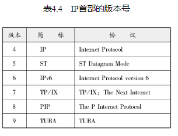
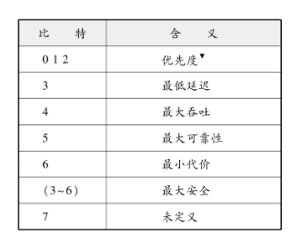
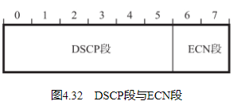
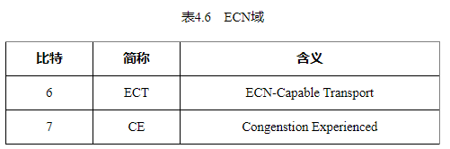

## 版本（Version）

由4比特构成，表示标识IP首部的版本号。IPv4的版本号即为4，因此在这个字段上的值也是“4”。

## 首部长度（IHL：Internet Header Length）

由4比特构成，表明IP首部的大小，单位为4字节（32比特）。对于没有可选项的IP包，首部长度则设置为“5”。也就是说，当没有可选项时，IP首部的长度为20字节（4×5=20）。

## 区分服务（TOS：Type Of Service）

由8比特构成，用来表明服务质量。每一位的具体含义如表4.5所示。

这个值通常由应用指定。而且现在也鼓励这种结合应用的特性设定TOS的方法。然而在目前，几乎所有的网络都无视这些字段。这不仅仅是因为在符合质量要求的情况下按其要求发送本身的功能实现起来十分困难，还因为若不符合质量要求就可能会产生不公平的现象。因此，实现TOS控制变得极其复杂。这也导致TOS整个互联网几乎就没有被投入使用。不过已有人提出将TOS字段本身再划分为DSCP和ECN两个字段的建议。

## DSCP段与ECN段

DSCP（Differential Services Codepoint，差分服务代码点）是TOS（Type Of Service）的一部分。现在统称为DiffServ（关于DiffServ的更多细节请参考5.8.3节。） ，用来进行质量控制。

ECN（Explicit Congestion Notification，显式拥塞通告）用来报告网络拥堵情况，由两个比特构成。

第6位的ECT用以通告上层TCP层协议是否处理ECN。当路由器在转发ECN为1的包的过程中，如果出现网络拥堵的情况，就将CE位设置为1（关于ECN的更多细节请参考5.8.4节。） 。

## 总长度（Total Length）

表示IP首部与数据部分合起来的总字节数。该字段长16比特。因此IP包的最大长度为65535（=216 ）字节。

## 标识（ID：Identification）

由16比特构成，用于分片重组。同一个分片的标识值相同，不同分片的标识值不同。通常，每发送一个IP包，它的值也逐渐递增。此外，即使ID相同，如果目标地址、源地址或协议不同的话，也会被认为是不同的分片。

## 标志（Flags）
由3比特构成，表示包被分片的相关信息。

## 片偏移（FO：Fragment Offset）
由13比特构成，用来标识被分片的每一个分段相对于原始数据的位置。第一个分片对应的值为0。由于FO域占13位，因此最多可以表示8192（=213 ）个相对位置。单位为8字节，因此最大可表示原始数据8×8192=65536字节的位置。

##  生存时间（TTL：Time To Live）

由8比特构成，它最初的意思是以秒为单位记录当前包在网络上应该生存的期限。然而，在实际中它是指可以中转多少个路由器的意思。每经过一个路由器，TTL会减少1，直到变成0则丢弃该包（TTL占8位，因此可以表示0～255的数字。因此一个包的中转路由的次数不会超过28 =256个。由此可以避免IP包在网络内无限传递的问题。） 。

## 协议（Protocol）
由8比特构成，表示IP首部的下一个首部隶属于哪个协议。

## 首部校验和（Header Checksum）

由16比特（2个字节）构成，也叫IP首部校验和。该字段只校验数据报的首部，不校验数据部分。它主要用来确保IP数据报不被破坏。校验和的计算过程，首先要将该校验和的所有位置设置为0，然后以16比特为单位划分IP首部，并用1补数（1补数　通常计算机中对整数运算采用2补数的方式。但在校验和的计算中采用1补数运算方法。这样做的优点在于即使产生进位也可以回到第1位，可以防止信息缺失并且可以用2个0区分使用。） 计算所有16位字的和。最后将所得到这个和的1补数赋给首部校验和字段。

## 源地址（Source Address）

由32比特（4个字节）构成，表示发送端IP地址。

## 目标地址（Destination Address）

由32比特（4个字节）构成，表示接收端IP地址。

## 可选项（Options）

长度可变，通常只在进行实验或诊断时使用。该字段包含如下几点信息：

安全级别
源路径
路径记录
时间戳

## 填充（Padding）

也称作填补物。在有可选项的情况下，首部长度可能不是32比特的整数倍。为此，通过向字段填充0，调整为32比特的整数倍。

## 数据（Data）

存入数据。将IP上层协议的首部也作为数据进行处理。