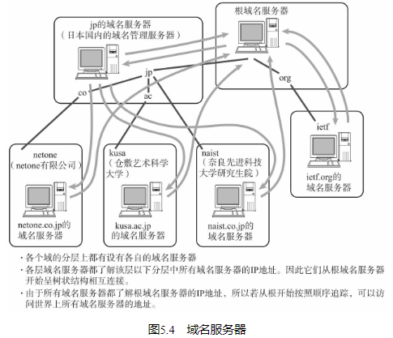

## IP地址不便记忆

为此，TCP/IP世界中从一开始就已经有了一个叫做主机识别码的东西。这种识别方式是指为每台计算机赋以唯一的主机名，在进行网络通信时可以直接使用主机名称而无需输入一大长串的IP地址。并且此时，系统必须自动将主机名转换为具体的IP地址。为了实现这样的功能，主机往往会利用一个叫做hosts的数据库文件。

## DNS的产生

有了DNS，不论网络规模变得多么庞大，都能在一个较小的范围内通过DNS进行管理。可以说DNS充分地解决了ARPANET初期遇到的问题。就算到现在，当人们访问任何一个Web站点时，都能够直接输入主机名进行访问，这也要归功于DNS。

## 域名的构成

域名服务器

域名服务器是指管理域名的主机和相应的软件，它可以管理所在分层的域的相关信息。其所管理的分层叫做ZONE。

因此，域名和域名服务器需要按照分层进行设置。如果域名服务器宕机，那么针对该域的DNS查询也就无法正常工作。因此，为了提高容灾能力，一般会设置至少两个以上的域名服务器。一旦第一个域名服务器无法提供查询时，就会自动转到第二个甚至第三个域名服务器上进行，以此可以按照顺序进行灾备处理。

所有的域名服务器都必须注册根域名服务器的IP地址。因为DNS根据IP地址进行检索时，需要从根域名服务器开始按顺序进行。

解析器（Resolver）

进行DNS查询的主机和软件叫做DNS解析器。用户所使用的工作站或个人电脑都属于解析器。一个解析器至少要注册一个以上域名服务器的IP地址。通常，它至少包括组织内部的域名服务器的IP地址。

## DNS查询

## DNS如同互联网中的分布式数据库