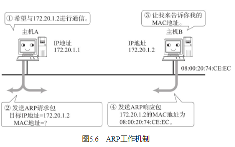
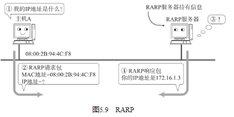

## ARP概要

ARP（Address Resolution Protocol） 是一种解决地址问题的协议。以目标IP地址为线索，用来定位下一个应该接收数据分包的网络设备对应的MAC地址。如果目标主机不在同一个链路上时，可以通过ARP查找下一跳路由器的MAC地址。不过ARP只适用于IPv4，不能用于IPv6。IPv6中可以用ICMPv6替代ARP发送邻居探索消息。

## ARP的工作机制

那么ARP又是如何知道MAC地址的呢？简单地说，ARP是借助ARP请求与ARP响应两种类型的包确定MAC地址的。

主机A为了获得主机B的MAC地址，起初要通过广播发送一个ARP请求包。这个包中包含了想要了解其MAC地址的主机IP地址。也就是说，ARP请求包中已经包含了主机B的IP地址172.20.1.2。由于广播的包可以被同一个链路上所有的主机或路由器接收，因此ARP的请求包也就会被这同一个链路上所有的主机和路由器进行解析。如果ARP请求包中的目标IP地址与自己的IP地址一致，那么这个节点就将自己的MAC地址塞入ARP响应包返回给主机A。

总之，从一个IP地址发送ARP请求包以了解其MAC地址（ARP请求包还有一个作用，那就是将自己的MAC地址告诉给对方。） ，目标地址将自己的MAC地址填入其中的ARP响应包返回到IP地址。由此，可以通过ARP从IP地址获得MAC地址，实现链路内的IP通信。

如果每发送一个IP数据报都要进行一次ARP请求以此确定MAC地址，那将会造成不必要的网络流量，因此，通常的做法是把获取到的MAC地址缓存（是指预见到同样的信息可能会再次使用，从而在内存中开辟一块区域记忆这些信息。） 一段时间。即把第一次通过ARP获取到的MAC地址作为IP对MAC的映射关系记忆（记录IP地址与MAC地址对应关系的数据库叫做ARP表。在UNIX或Windows中可以通过“arp-a”命令获取该表信息。） 到一个ARP缓存表中，下一次再向这个IP地址发送数据报时不需再重新发送ARP请求，而是直接使用这个缓存表当中的MAC地址进行数据报的发送。每执行一次ARP，其对应的缓存内容都会被清除。不过在清除之前都可以不需要执行ARP就可以获取想要的MAC地址。这样，在一定程度上也防止了ARP包在网络上被大量广播的可能性。

一般来说，发送过一次IP数据报的主机，继续发送多次IP数据报的可能性会比较高。因此，这种缓存能够有效地减少ARP包的发送。反之，接收ARP请求的那个主机又可以从这个ARP请求包获取发送端主机的IP地址及其MAC地址。这时它也可以将这些MAC地址的信息缓存起来，从而根据MAC地址发送ARP响应包给发送端主机。类似地，接收到IP数据报的主机又往往会继续返回IP数据报给发送端主机，以作为响应。因此，在接收主机端缓存MAC地址也是一种提高效率的方法。

不过，MAC地址的缓存是有一定期限的。超过这个期限，缓存的内容将被清除。这使得MAC地址与IP地址对应关系即使发生了变化（尤其是在换网卡，或移动笔记本电脑、智能终端时。） ，也依然能够将数据包正确地发送给目标地址。

## IP地址和MAC地址缺一不可？

## RARP

RARP（Reverse Address Resolution Protocol）是将ARP反过来，从MAC地址定位IP地址的一种协议。例如将打印机服务器等小型嵌入式设备接入到网络时就经常会用得到。

平常我们可以通过个人电脑设置IP地址，也可以通过DHCP（Dynamic Host Configuration Protocol，具体请参考5.5节。DHCP可以像RARP一样分配一个固定的IP地址。） 自动分配获取IP地址。然而，对于使用嵌入式设备时，会遇到没有任何输入接口或无法通过DHCP动态获取IP地址的情况（通过个人电脑连接这个嵌入式设备时虽然可以为其指定IP地址，但是用DHCP动态分配IP地址，有时会遇到无法知道所分配的IP是多少的情况。） 。

在类似情况下，就可以使用RARP。为此，需要架设一台RARP服务器，从而在这个服务器上注册设备的MAC地址及其IP地址（使用RARP的前提是认为MAC地址就是设备固有的一个值。） 。然后再将这个设备接入到网络，插电启动设备时，该设备会发送一条“我的MAC地址是XXX，请告诉我，我的IP地址应该是什么”的请求信息。RARP服务器接到这个消息后返回类似于“MAC地址为 XXX 的设备，IP地址为 XXX”的信息给这个设备。而设备就根据从RARP服务器所收到的应答信息设置自己的IP地址。

## 代理ARP
通常ARP包会被路由器隔离，但是采用代理ARP（Proxy ARP）的路由器可以将ARP请求转发给邻近的网段。由此，两个以上网段的节点之间可以像在同一个网段中一样进行通信。

在目前的TCP/IP网络当中，一般情况下用路由器连接多个网络时，会在每个网段上定义各自的子网，从而进行路由控制。然而，对于那些不支持设定子网掩码的老设备来说，不使用代理ARP，有时就无法更好地使用网络。