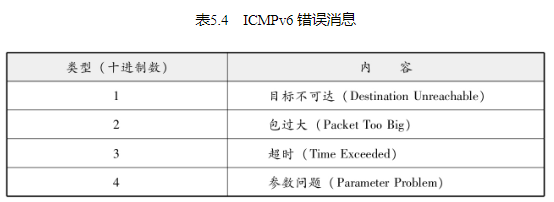

## 辅助IP的ICMP

架构IP网络时需要特别注意两点：确认网络是否正常工作，以及遇到异常时进行问题诊断。ICMP正是提供这类功能的一种协议。

ICMP的主要功能包括，确认IP包是否成功送达目标地址，通知在发送过程当中IP包被废弃的具体原因，改善网络设置等。有了这些功能以后，就可以获得网络是否正常、设置是否有误以及设备有何异常等信息，从而便于进行网络上的问题诊断（不过，ICMP是基于尽力而为的IP上进行工作的，因此无法保证服务质量，而且在网络安全优先于便利性的环境里往往无法使用ICMP，因此不宜过分依赖ICMP。） 

ICMP的消息大致可以分为两类：一类是通知出错原因的错误消息，另一类是用于诊断的查询消息。（如图5.3）

## 主要的ICMP消息

IP路由器无法将IP数据包发送给目标地址时，会给发送端主机返回一个目标不可达（Destination Unreachable Message）的ICMP消息，并在这个消息中显示不可达的具体原因，如表5.3所示。

在实际通信当中经常会遇到的错误代码是1，表示主机不可达（Host Unreachable）（自从不再有网络分类以后，Network Unreachable也渐渐不再使用了。） ，它是指路由表中没有该主机的信息，或者该主机没有连接到网络的意思。此外，错误代码4（Fragmentation Needed and Don't Fragment was Set）则用于前面4.5.3节介绍过的MTU探索。由此，根据ICMP不可达的具体消息，发送端主机也就可以了解此次发送不可达的具体原因。

### ICMP重定向消息（类型5）

如果路由器发现发送端主机使用了次优的路径发送数据，那么它会返回一个ICMP重定向（ICMP Redirect Message）的消息给这个主机。在这个消息中包含了最合适的路由信息和源数据。这主要发生在路由器持有更好的路由信息的情况下。路由器会通过这样的ICMP消息给发送端主机一个更合适的发送路由。不过，多数情况下由于这种重定向消息成为引发问题的原因，所以往往不进行这种设置（例如，不是发送端主机，而是途中某个路由器的路由控制表不正确时，ICMP有可能无法正常工作。） 。

###  ICMP超时消息（类型11）

IP包中有一个字段叫做TTL（Time To Live，生存周期），它的值随着每经过一次路由器就会减1（当IP包在路由器上停留1秒以上时减去所停留的秒数，但是现在绝大多数设备并不做这样的处理。） ，直到减到0时该IP包会被丢弃。此时，IP路由器将会发送一个ICMP超时的消息（ICMP Time Exceeded Message，错误号0（错误号1表示将被拆分包做重构处理时超时。） ）给发送端主机，并通知该包已被丢弃。

设置IP包生存周期的主要目的，是为了在路由控制遇到问题发生循环状况时，避免IP包无休止地在网络上被转发。此外，有时可以用TTL控制包的到达范围，例如设置一个较小的TTL值。

###  ICMP回送消息（类型0、8）

用于进行通信的主机或路由器之间，判断所发送的数据包是否已经成功到达对端的一种消息。可以向对端主机发送回送请求的消息（ICMP Echo Request Message，类型8），也可以接收对端主机发回来的回送应答消息（ICMP Echo Reply Message，类型0）。网络上最常用的ping命令（Packet InterNetwork Groper，判断对端主机是否可达的一种命令。） 就是利用这个消息实现的。

## 其他ICMP消息

## ICMPv6

### ICMPv6的作用

IPv4中ICMP仅作为一个辅助作用支持IPv4。也就是说，在IPv4时期，即使没有ICMP，仍然可以实现IP通信。然而，在IPv6中，ICMP的作用被扩大，如果没有ICMPv6，IPv6就无法进行正常通信。

尤其在IPv6中，从IP地址定位MAC地址的协议从ARP转为ICMP的邻居探索消息（Neighbor Discovery）。这种邻居探索消息融合了IPv4的ARP、ICMP重定向以及ICMP路由器选择消息等功能于一体，甚至还提供自动设置IP地址的功能（ICMPv6中没有DNS服务器的通知功能，因此实际上需要与DHCPv6组合起来才能实现自动设置IP地址。） 。

ICMPv6中将ICMP大致分为两类：一类是错误消息，另一类是信息消息。类型0～127属于错误消息，128～255属于信息消息。

### 邻居探索

ICMPv6中从类型133至类型137的消息叫做邻居探索消息。这种邻居探索消息对于IPv6通信起着举足轻重的作用。邻居请求消息用于查询IPv6的地址与MAC地址的对应关系，并由邻居宣告消息得知MAC地址（IPv4中查询IP地址与MAC地址对应关系用到的是ARP。） 。邻居请求消息利用IPv6的多播地址（IPv4中所使用的ARP采用广播，使得不支持ARP的节点也会收到包，造成一定的浪费。） 实现传输。

此外，由于IPv6中实现了即插即用的功能，所以在没有DHCP服务器的环境下也能实现IP地址的自动获取。如果是一个没有路由器的网络，就使用MAC地址作为链路本地单播地址（4.6.6节）。而在一个有路由器的网络环境中，可以从路由器获得IPv6地址的前面部分，后面部分则由MAC地址进行设置。此时可以利用路由器请求消息和路由器宣告消息进行设置。