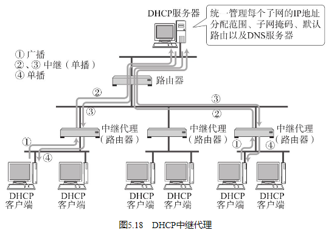

## DHCP实现即插即用

## DHCP的工作机制

使用DHCP之前，首先要架设一台DHCP服务器（很多时候用该网段的路由器充当DHCP服务器。） 。然后将DHCP所要分配的IP地址设置到服务器上。此外，还需要将相应的子网掩码、路由控制信息以及DNS服务器的地址等设置到服务器上。

使用DHCP时，如果DHCP服务器遇到故障，将导致无法自动分配IP地址，从而也导致网段内所有主机之间无法进行TCP/IP通信。为了避免此类问题的发生，通常人们会架设两台或两台以上的DHCP服务器。不过启动多个DHCP服务器时，由于每个服务器内部都记录着IP地址分配情况的信息，因此可能会导致几处分配的IP地址相互冲突（为了避免这种地址重复的危险，可以在DHCP服务器上区分所要分配的地址。） 。

为了检查所要分配的IP地址以及已经分配了的IP地址是否可用，DHCP服务器或DHCP客户端必须具备以下功能：

DHCP服务器
在分配IP地址前发送ICMP回送请求包，确认没有返回应答。

DHCP客户端
针对从DHCP那里获得的IP地址发送ARP请求包，确认没有返回应答。

在获得IP地址之前做这种事先处理可能会耗一点时间，但是可以安全地进行IP地址分配。

## DHCP中继代理

因此，在这类网络环境中，往往需要将DHCP统一管理。具体方法可以使用DHCP中继代理来实现。有了DHCP中继代理以后，对不同网段的IP地址分配也可以由一个DHCP服务器统一进行管理和运维。

这种方法使得在每个网段架设一个DHCP服务器被取代，只需在每个网段设置一个DHCP中继代理即可（DHCP中继代理多数为路由器，不过也有在主机中安装某些软件得以实现的情况。） 。它可以设置DHCP服务器的IP地址，从而可以在DHCP服务器上为每个网段注册IP地址的分配范围。

DHCP客户端会向DHCP中继代理发送DHCP请求包，而DHCP中继代理在收到这个广播包以后再以单播的形式发给DHCP服务器。服务器端收到该包以后再向DHCP中继代理返回应答，并由DHCP中继代理将此包转发给DHCP客户端（DHCP包中包含发出请求的主机的MAC地址。DHCP中继代理正是利用这个MAC地址将包返回给了DHCP客户端。） 。由此，DHCP服务器即使不在同一个链路上也可以实现统一分配和管理IP地址。

