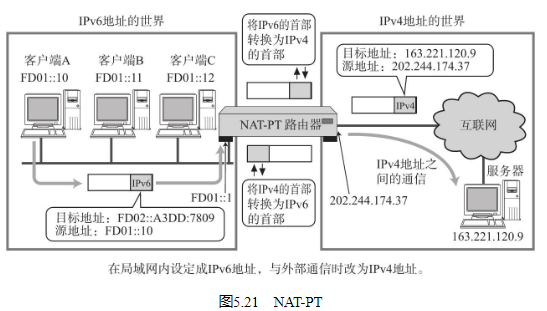

## NAT定义

NAT（Network Address Translator）是用于在本地网络中使用私有地址，在连接互联网时转而使用全局IP地址的技术。除转换IP地址外，还出现了可以转换TCP、UDP端口号的NAPT（Network Address Ports Translator）技术，由此可以实现用一个全局IP地址与多个主机的通信（通常人们提到的NAT，多半是指NAPT。NAPT也叫做IP伪装或Multi NAT。） 。

NAT（NAPT）实际上是为正在面临地址枯竭的IPv4而开发的技术。不过，在IPv6中为了提高网络安全也在使用NAT，在IPv4和IPv6之间的相互通信当中常常使用NAT-PT（可参考5.6.3节。） 。

## NAT的工作机制

## NAT-PT（NAPT-PT）

现在很多互联网服务都基于IPv4。如果这些服务不能做到在IPv6中也能正常使用的话，搭建IPv6网络环境的优势也就无从谈起了。

为了解决这个问题，就产生了NAT-PT（NAPT-PT）（PT是Protocol Translatio的缩写。严格来讲NAT-PT用来翻译IP地址，而NATP-PT则是用来翻译IP首部与端口号的。） 规范。NAT-PT是将IPv6的首部转换为IPv4的首部的一种技术。有了这种技术，那些只有IPv6地址的主机也就能够与IPv4地址的其他主机进行通信了。

## NAT的潜在问题

由于NAT（NAPT）都依赖于自己的转换表，因此会有如下几点限制：

无法从NAT的外部向内部服务器建立连接（虽然可以指定端口号允许向内部访问，但是数量要受限于全局IP地址的个数。） 。
转换表的生成与转换操作都会产生一定的开销。
通信过程中一旦NAT遇到异常需重新启动时，所有的TCP连接都将被重置。
即使备置两台NAT做容灾备份，TCP连接还是会被断开。

## 解决NAT的潜在问题与NAT穿越

解决NAT上述潜在的问题有两种方法：

第一种方法就是改用IPv6。另一种方法是，即使是在一个没有NAT的环境里，根据所制作的应用，用户可以完全忽略NAT的存在而进行通信。在NAT内侧（私有IP地址的一边）主机上运行的应用为了生成NAT转换表，需要先发送一个虚拟的网络包给NAT的外侧。而NAT并不知道这个虚拟的包究竟是什么，还是会照样读取包首部中的内容并自动生成一个转换表。这时，如果转换表构造合理，那么还能实现NAT外侧的主机与内侧的主机建立连接进行通信。有了这个方法，就可以让那些处在不同NAT内侧的主机之间也能够进行相互通信。此外，应用还可以与NAT路由器进行通信生成NAT表，并通过一定的方法将NAT路由器上附属的全局IP地址传给应用（可以使用微软提供的UPnP（Universal Plug and Play）规范。） 。

如此一来，NAT外侧与内侧可以进行通信，这种现象叫做“NAT穿越”。于是NAT那个“无法从NAT的外部向内部服务器建立连接”的问题也就迎刃而解了。而且这种方法与已有的IPv4环境的兼容性非常好，即使不迁移到IPv6也能通信自如。出于这些优势，市面上已经出现了大量与NAT紧密集合的应用（由此，IPv4的寿命又被延长，向IPv6的迁移也就放慢脚步了。） 。

然而，NAT友好的应用程序也有它的问题。例如，NAT的规范越来越复杂，应用的实现变得更耗时。而且应用一旦运行在一个开发者未预想到的特殊网络环境中时，会出现无法正常工作、遇到状况时难于诊断等问题（迁移到IPv6以后，系统会变得更为简单，因此它有着相当大的优势。如果同时使用IPv4和IPv6，会导致系统变得更为复杂。这对于系统开发、设计、运用等人员来说，是一件非常麻烦的事。）