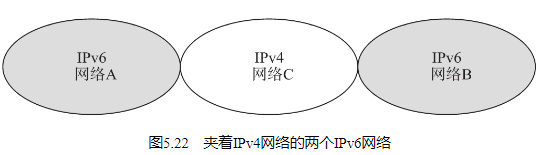
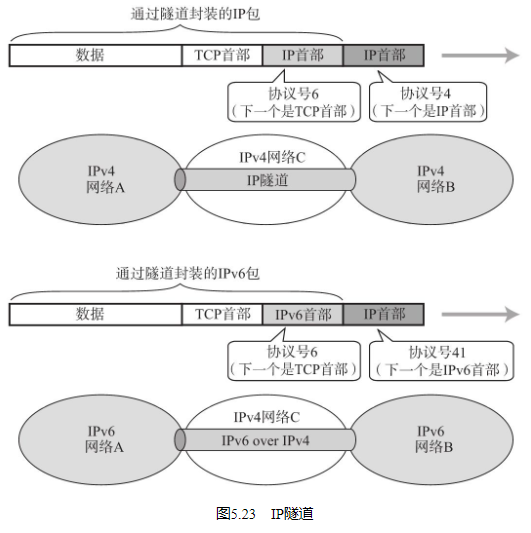
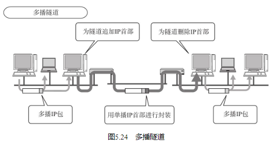

IP隧道中可以将那些从网络A发过来的IPv6的包统和为一个数据，再为之追加一个IPv4的首部以后转发给网络C。

一般情况下，紧接着IP首部的是TCP或UDP的首部。然而，现在的应用当中“IP首部的后面还是IP首部”或者“IP首部的后面是IPv6的首部”等情况与日俱增。这种在网络层的首部后面继续追加网络层首部的通信方法就叫做“IP隧道”。

构造一个既支持IPv4又支持IPv6的网络是一项极其庞大的工程。在这种网络环境中，由于其路由表的量有可能会涨到平常的两倍，所以会给网络管理员增加不小的负担，而在路由器进行两种协议都要支持的设置也是相当费劲的事情。骨干网上通常使用IPv6或IPv4进行传输。因此，那些不支持的路由器就可以采用IP隧道的技术转发数据包，而对应的IP地址也可以在一旁进行统一管理。这就在一定程度上减轻了管理员的部分工作（隧道一旦设置有误，会导致数据包在网络上无限循环等严重问题。因此此处的设置需要极其谨慎。） 。此外，由于骨干网的设备上仅在一旁应对IP隧道即可，这也可以大量地减少投资成本。

