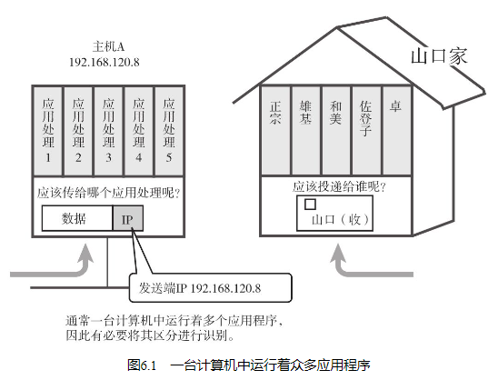
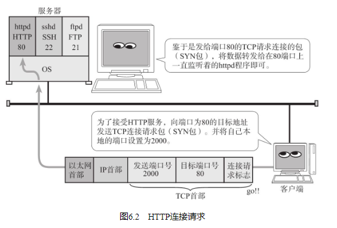

## 传输层定义

## 通信处理

这些服务端程序在UNIX系统当中叫做守护进程。例如HTTP的服务端程序是httpd（HTTP守护进程），而ssh的服务端程序是sshd（SSH守护进程）。在UNIX中并不需要将这些守护进程逐个启动，而是启动一个可以代表它们接收客户端请求的inetd（互联网守护进程）服务程序即可。它是一种超级守护进程。该超级守护进程收到客户端请求以后会创建（fork）新的进程并转换（exec）为sshd等各个守护进程。

确认一个请求究竟发给的是哪个服务端（守护进程），可以通过所收到数据包的目标端口号轻松识别。当收到TCP的建立连接请求时，如果目标端口为22，则转给sshd，如果是80则转给httpd。然后，这些守护进程会继续对该连接上的通信传输进行处理。

传输协议TCP、UDP通过接收数据中的目标端口号识别目标处理程序。以图6.2为例，传输协议的数据将被传递给HTTP、TELNET以及FTP等应用层协议。

## 两种传输层协议TCP和UDP

TCP

TCP是面向连接的、可靠的流协议。流就是指不间断的数据结构，你可以把它想象成排水管道中的水流。当应用程序采用TCP发送消息时，虽然可以保证发送的顺序，但还是犹如没有任何间隔的数据流发送给接收端（例如，在发送端应用程序发送了10次100字节的消息，那么在接收端，应用程序有可能会收到一个1000字节连续不间断的数据。因此在TCP通信中，发送端应用可以在自己所要发送的消息中设置一个表示长度或间隔的字段信息。） 。

TCP为提供可靠性传输，实行“顺序控制”或“重发控制”机制。此外还具备“流控制（流量控制）”、“拥塞控制”、提高网络利用率等众多功能。

UDP

UDP是不具有可靠性的数据报协议。细微的处理它会交给上层的应用去完成。在UDP的情况下，虽然可以确保发送消息的大小（例如，发送端应用程序发送一个100字节的消息，那么接收端应用程序也会以100字节为长度接收数据。UDP中，消息长度的数据也会发送到接收端，因此在发送的消息中不需要设置一个表示消息长度或间隔的字段信息。然而，UDP不具备可靠传输。所以，发送端发出去的消息在网络传输途中一旦丢失，接收端将收不到这个消息。） ，却不能保证消息一定会到达。因此，应用有时会根据自己的需要进行重发处理。

## TCP与UDP区分

TCP用于在传输层有必要实现可靠传输的情况。由于它是面向有连接并具备顺序控制、重发控制等机制的，所以它可以为应用提供可靠传输。

而在一方面，UDP主要用于那些对高速传输和实时性有较高要求的通信或广播通信。我们举一个通过IP电话进行通话的例子。如果使用TCP，数据在传送途中如果丢失会被重发，但这样无法流畅地传输通话人的声音，会导致无法进行正常交流。而采用UDP，它不会进行重发处理。从而也就不会有声音大幅度延迟到达的问题。即使有部分数据丢失，也只是会影响某一小部分的通话（在实时传送动画或声音时，途中一小部分网络的丢包可能会导致画面或声音的短暂停顿甚至出现混乱。但在实际使用当中，这一点干扰并无大碍。） 。此外，在多播与广播通信中也使用UDP而不是TCP。RIP（7.4节）、DHCP（5.5节）等基于广播的协议也要依赖于UDP。

因此，TCP和UDP应该根据应用的目的按需使用。