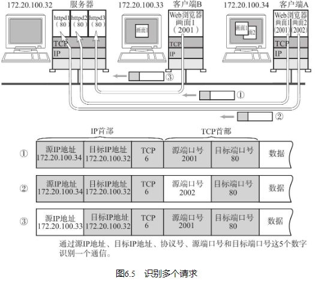

## 端口号定义

数据链路和IP中的地址，分别指的是MAC地址和IP地址。前者用来识别同一链路中不同的计算机，后者用来识别TCP/IP网络中互连的主机和路由器。在传输层中也有这种类似于地址的概念，那就是端口号。端口号用来识别同一台计算机中进行通信的不同应用程序。因此，它也被称为程序地址。

## 根据端口号识别应用

## 通过IP地址、端口号、协议号进行通信识别

仅凭目标端口识别某一个通信是远远不够的。因此，TCP/IP或UDP/IP通信中通常采用5个信息来识别（这个信息可以在Unix或Windows系统中通过netstat -n 命令显示。） 一个通信。它们是“源IP地址”、“目标IP地址”、“协议号”、“源端口号”、“目标端口号”。只要其中某一项不同，则被认为是其他通信。

## 端口号如何确定

在实际进行通信时，要事先确定端口号。确定端口号的方法分为两种：

标准既定的端口号

这种方法也叫静态方法。它是指每个应用程序都有其指定的端口号。但并不是说可以随意使用任何一个端口号。每个端口号都有其对应的使用目的（当然，这也不是说“绝对地只能有这样一个目的”。在更高级的网络应用中有时也会别作他用。） 。

时序分配法

第二种方法也叫时序（或动态的）分配法。此时，服务端有必要确定监听端口号，但是接受服务的客户端没必要确定端口号。

在这种方法下，客户端应用程序可以完全不用自己设置端口号，而全权交给操作系统进行分配。操作系统可以为每个应用程序分配互不冲突的端口号。例如，每需要一个新的端口号时，就在之前分配号码的基础上加1。这样，操作系统就可以动态地管理端口号了。

根据这种动态分配端口号的机制，即使是同一个客户端程序发起的多个TCP连接，识别这些通信连接的5部分数字也不会全部相同。

动态分配的端口号取值范围在49152到65535之间（在较老的系统中有时会依次使用1024以上空闲的端口。） 。

## 端口号与协议

端口号由其使用的传输层协议决定。因此，不同的传输协议可以使用相同的端口号。例如，TCP与UDP使用同一个端口号，但使用目的各不相同。这是因为端口号上的处理是根据每个传输协议的不同而进行的。

数据到达IP层后，会先检查IP首部中的协议号，再传给相应协议的模块。如果是TCP则传给TCP模块、如果是UDP则传给UDP模块去做端口号的处理。即使是同一个端口号，由于传输协议是各自独立地进行处理，因此相互之间不会受到影响。

此外，那些知名端口号与传输层协议并无关系，只要端口一致都将分配同一种程序进行处理。例如，53号端口在TCP与UDP中都用于DNS（由域名确定IP地址时所用的协议。更多细节请参考5.2节。） 服务，而80端口用于HTTP通信。从目前来看，由于HTTP通信必须使用TCP，因此UDP的80端口并未投入使用。但是将来，如果HTTP协议的实现也开始应对UDP协议以及应用协议被相应扩展的情况下，就可以原样使用与TCP保持相同的80端口号了。