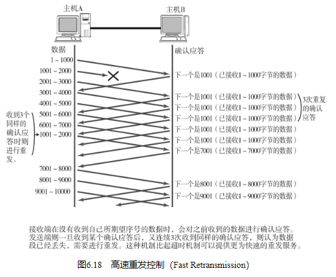

## TCP的特点及其目的

TCP通过检验和、序列号、确认应答、重发控制、连接管理以及窗口控制等机制实现可靠性传输。

## 通过序列号与确认应答提高可靠性

在TCP中，当发送端的数据到达接收主机时，接收端主机会返回一个已收到消息的通知。这个消息叫做确认应答（ACK（ACK（Positive Acknowled-gement）意指已经接收。） ）。

如图6.8所示，在一定时间内没有等到确认应答，发送端就可以认为数据已经丢失，并进行重发。由此，即使产生了丢包，仍然能够保证数据能够到达对端，实现可靠传输。

未收到确认应答并不意味着数据一定丢失。也有可能是数据对方已经收到，只是返回的确认应答在途中丢失。这种情况也会导致发送端因没有收到确认应答，而认为数据没有到达目的地，从而进行重新发送。如图6.9所示。

此外，也有可能因为一些其他原因导致确认应答延迟到达，在源主机重发数据以后才到达的情况也履见不鲜。此时，源发送主机只要按照机制重发数据即可。但是对于目标主机来说，这简直是一种“灾难”。它会反复收到相同的数据。而为了对上层应用提供可靠的传输，必须得放弃重复的数据包。为此，就必须引入一种机制，它能够识别是否已经接收数据，又能够判断是否需要接收。

上述这些确认应答处理、重发控制以及重复控制等功能都可以通过序列号实现。序列号是按顺序给发送数据的每一个字节（8位字节）都标上号码的编号（序列号的初始值并非为0。而是在建立连接以后由随机数生成。而后面的计算则是对每一字节加一。） 。接收端查询接收数据TCP首部中的序列号和数据的长度，将自己下一步应该接收的序号作为确认应答返送回去。就这样，通过序列号和确认应答号，TCP可以实现可靠传输。

## 重发超时如何确定

最理想的是，找到一个最小时间，它能保证“确认应答一定能在这个时间内返回”。然而这个时间长短随着数据包途径的网络环境的不同而有所变化。例如在高速的LAN中时间相对较短，而在长距离的通信当中应该比LAN要长一些。即使是在同一个网络中，根据不同时段的网络拥堵程度时间的长短也会发生变化。

TCP要求不论处在何种网络环境下都要提供高性能通信，并且无论网络拥堵情况发生何种变化，都必须保持这一特性。为此，它在每次发包时都会计算往返时间（Round Trip Time也叫RTT。是指报文段的往返时间。） 及其偏差（RTT时间波动的值、方差。有时也叫抖动。） 。将这个往返时间和偏差相加重发超时的时间，就是比这个总和要稍大一点的值。

重发超时的计算既要考虑往返时间又要考虑偏差是有其原因。如图6.11所示，根据网络环境的不同往返时间可能会产生大幅度的摇摆，之所以发生这种情况是因为数据包的分段是经过不同线路到达的。TCP/IP的目的是即使在这种环境下也要进行控制，尽量不要浪费网络流量。

数据被重发之后若还是收不到确认应答，则进行再次发送。此时，等待确认应答的时间将会以2倍、4倍的指数函数延长。

此外，数据也不会被无限、反复地重发。达到一定重发次数之后，如果仍没有任何确认应答返回，就会判断为网络或对端主机发生了异常，强制关闭连接。并且通知应用通信异常强行终止。

## 连接管理

可以使用TCP首部用于控制的字段来管理TCP连接（也叫控制域。更多细节请参考6.7节。） 。一个连接的建立与断开，正常过程至少需要来回发送7个包才能完成（建立一个TCP连接需要发送3个包。这个过程也称作“三次握手”。） 。

## TCP以段为单位发送数据

在建立TCP连接的同时，也可以确定发送数据包的单位，我们也可以称其为“最大消息长度”（MSS：Maximum Segment Size）。最理想的情况是，最大消息长度正好是IP中不会被分片处理的最大数据长度。

TCP在传送大量数据时，是以MSS的大小将数据进行分割发送。进行重发时也是以MSS为单位。

## 利用窗口控制提高速度

TCP以1个段为单位，每发一个段进行一次确认应答的处理，如图6.14。这样的传输方式有一个缺点。那就是，包的往返时间越长通信性能就越低。

为解决这个问题，TCP引入了窗口这个概念。即使在往返时间较长的情况下，它也能控制网络性能的下降。图6.15所示，确认应答不再是以每个分段，而是以更大的单位进行确认时，转发时间将会被大幅度的缩短。也就是说，发送端主机，在发送了一个段以后不必要一直等待确认应答，而是继续发送。窗口大小就是指无需等待确认应答而可以继续发送数据的最大值。

这个机制实现了使用大量的缓冲区（缓冲区（Buffer）在此处表示临时保存收发数据的场所。通常是在计算机内存中开辟的一部分空间。） ，通过对多个段同时进行确认应答的功能。

## 窗口控制与重发控制

如图6.18所示。当某一报文段丢失后，发送端会一直收到序号为1001的确认应答，这个确认应答好像在提醒发送端“我想接收的是从1001开始的数据”。因此，在窗口比较大，又出现报文段丢失的情况下，同一个序号的确认应答将会被重复不断地返回。而发送端主机如果连续3次收到同一个确认应答（之所以连续收到3次而不是两次的理由是因为，即使数据段的序号被替换两次也不会触发重发机制。） ，就会将其所对应的数据进行重发。这种机制比之前提到的超时管理更加高效，因此也被称作高速重发控制。

## 流控制

为了防止这种现象的发生，TCP提供一种机制可以让发送端根据接收端的实际接收能力控制发送的数据量。这就是所谓的流控制。它的具体操作是，接收端主机向发送端主机通知自己可以接收数据的大小，于是发送端会发送不超过这个限度的数据。该大小限度就被称作窗口大小。在前面6.4.6节中所介绍的窗口大小的值就是由接收端主机决定的。

TCP首部中，专门有一个字段用来通知窗口大小。接收主机将自己可以接收的缓冲区大小放入这个字段中通知给发送端。这个字段的值越大，说明网络的吞吐量越高。

## 拥塞控制

有了TCP的窗口控制，收发主机之间即使不再以一个数据段为单位发送确认应答，也能够连续发送大量数据包。然而，如果在通信刚开始时就发送大量数据，也可能会引发其他问题。

一般来说，计算机网络都处在一个共享的环境。因此也有可能会因为其他主机之间的通信使得网络拥堵。在网络出现拥堵时，如果突然发送一个较大量的数据，极有可能会导致整个网络的瘫痪。

TCP为了防止该问题的出现，在通信一开始时就会通过一个叫做慢启动的算法得出的数值，对发送数据量进行控制。

## 提高网络利用率的规范

## 使用TCP的应用