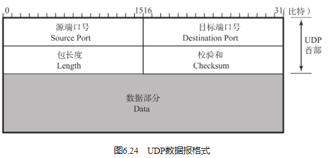

源端口号（Source Port）

表示发送端端口号，字段长16位。该字段是可选项，有时可能不会设置源端口号。没有源端口号的时候该字段的值设置为0。可用于不需要返回的通信中（例如，只针对某个主机或应用，亦或针对某个组织，只单方面发送更新消息，不需要接收端返回任何确认或应答。） 。

目标端口号（Destination Port）

表示接收端端口，字段长度16位。

包长度（Length）

该字段保存了UDP首部的长度跟数据的长度之和（在UDP-Lite（6.5.1节）中，该字段变为Checksum Coverage，表示校验和的计算范围。） 。单位为字节（8位字节）。

校验和（Checksum）

校验和是为了提供可靠的UDP首部和数据而设计。在计算校验和时，如图6.25所示，附加在UDP伪首部与UDP数据报之前。通过在最后一位增加一个“0”将全长增加16倍。此时将UDP首部的校验和字段设置为“0”。然后以16比特为单位进行1的补码（通常在计算机的整数计算中常用2的补码形式。而在校验和计算中之所以使用1的补码形式，是因为即使有一位溢出会回到第1位，也不会造成信息丢失。而且在这种形式下0可以有两种表示方式，因此有用0表示两种不同意思的优点。） 和，并将所得到的1的补码和写入校验和字段。