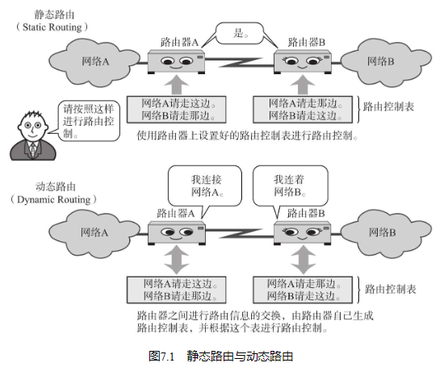
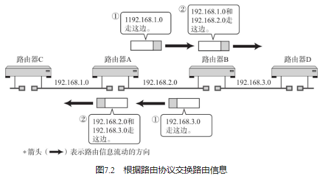

## IP地址与路由控制
互联网是由路由器连接的网络组合而成的。为了能让数据包正确达地到达目标主机，路由器必须在途中进行正确地转发。这种向“正确的方向”转发数据所进行的处理就叫做路由控制或路由。

路由器根据路由控制表（Routing Table）转发数据包。它根据所收到的数据包中目标主机的IP地址与路由控制表的比较得出下一个应该接收的路由器。

## 静态路由与动态路由

静态路由是指事先设置好路由器和主机中并将路由信息固定的一种方法。而动态路由是指让路由协议在运行过程中自动地设置路由控制信息的一种方法。这些方法都有它们各自的利弊。

静态路由的设置通常是由使用者手工操作完成的。例如，有100个IP网的时候，就需要设置近100个路由信息。并且，每增加一个新的网络，就需要将这个新被追加的网络信息设置在所有的路由器上。因此，静态路由给管理者带来很大的负担，这是其一。还有一个不可忽视的问题是，一旦某个路由器发生故障，基本上无法自动绕过发生故障的节点，只有在管理员手工设置以后才能恢复正常。

使用动态路由的情况下，管理员必须设置好路由协议，其设定过程的复杂程度与具体要设置路由协议的类型有直接关系。例如在RIP的情况下，基本上无需过多的设置。而根据OSPF进行较详细路由控制时，设置工作将会非常繁琐。

## 动态路由的基础

动态路由如图7.2所示，会给相邻路由器发送自己已知的网络连接信息，而这些信息又像接力一样依次传递给其他路由器，直至整个网络都了解时，路由控制表也就制作完成了。而此时也就可以正确转发IP数据包了（图7.2中的传输，只有在没有循环的情况下才能很好地运行。例如路由器C和路由器D之间如果有连接，那么将无法正常工作。） 。

