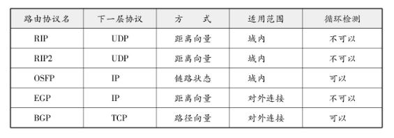

## 距离向量算法

距离向量算法（DV）是指根据距离（代价（Metric是指转发数据时衡量路由控制中距离和成本的一种指标。在距离向量算法中，代价相当于所要经过的路由器的个数。） ）和方向决定目标网络或目标主机位置的一种方法。

路由器之间可以互换目标网络的方向及其距离的相关信息，并以这些信息为基础制作路由控制表。这种方法在处理上比较简单，不过由于只有距离和方向的信息，所以当网络构造变得分外复杂时，在获得稳定的路由信息之前需要消耗一定时间（也叫做路由收敛。） ，也极易发生路由循环等问题。

## 链路状态算法

链路状态算法是路由器在了解网络整体连接状态的基础上生成路由控制表的一种方法。该方法中，每个路由器必须保持同样的信息才能进行正确的路由选择。

距离向量算法中每个路由器掌握的信息都不相同。通往每个网络所耗的距离（代价）也根据路由器的不同而不同。因此，该算法的一个缺点就是不太容易判断每个路由器上的信息是否正确。

而链路状态算法中所有路由器持有相同的信息。对于任何一台路由器，网络拓扑都完全一样。因此，只要某一台路由器与其他路由器保持同样的路由控制信息，就意味着该路由器上的路由信息是正确的。只要每个路由器尽快地与其他路由器同步（同步一词常用于分布式系统，意指所有系统中保持同样的值。） 路由信息，就可以使路由信息达到一个稳定的状态。因此，即使网络结构变得复杂，每个路由器也能够保持正确的路由信息、进行稳定的路由选择。这也是该算法的一个优点。

为了实现上述机制，链路状态算法付出的代价就是如何从网络代理获取路由信息表。这一过程相当复杂，特别是在一个规模巨大而又复杂的网络结构中，管理和处理代理信息需要高速CPU处理能力和大量的内存（为此，OSPF正致力于将网络分割为不同的区域，以减少路由控制信息。） 。

## 主要路由协议

