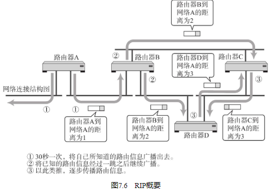
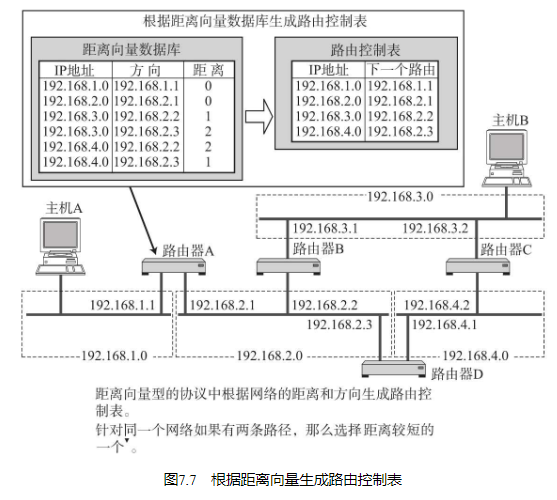

RIP（Routing Information Protocol）是距离向量型的一种路由协议，广泛用于LAN。被BSD UNIX作为标准而提供的routed（在UNIX系统上的一个守护进程。该进程实现了RIP协议。） 采用了RIP，因此RIP得到了迅速的普及。

## 广播路由控制信息

RIP将路由控制信息定期（30秒一次）向全网广播。如果没有收到路由控制信息，连接就会被断开。不过，这有可能是由于丢包导致的，因此RIP规定等待5次。如果等了6次（180秒）仍未收到路由信息，才会真正关闭连接。

## 根据距离向量确定路由

RIP基于距离向量算法决定路径。距离（Metrics）的单位为“跳数”。跳数是指所经过的路由器的个数。RIP希望尽可能少通过路由器将数据包转发到目标IP地址，如图7.7所示。根据距离向量生成距离向量表，再抽出较小的路由生成最终的路由控制表。

## 使用子网掩码时的RIP处理

RIP虽然不交换子网掩码信息，但可以用于使用子网掩码的网络环境。不过在这种情况下需要注意以下几点：

从接口的IP地址对应分类得出网络地址后，与根据路由控制信息流过此路由器的包中的IP地址对应的分类得出的网络地址进行比较。如果两者的网络地址相同，那么就以接口的网络地址长度为准。
如果两者的网络地址不同，那么以IP地址的分类所确定的网络地址长度为准。

## RIP中路由变更时的处理

路由器A虽然觉察到自己与网络A的连接已经断开，无法将网络A的信息发送给路由器B，但是它会收到路由器B曾经获知的消息。这就使得路由器A误认为自己的信息还可以通过路由器B到达网络A。

像这样收到自己发出去的消息，这个问题被称为无限计数（Counting to Infinity）。为了解决这个问题可以采取以下两种方法：

一是最长距离不超过16（“距离为16”这个信息只会被保留120秒。一旦超过这个时间，信息将会被删除，无法发送。这个时间由一个叫做垃圾收集计时器（Garbage-collection Timer）的工具进行管理。） 。由此即使发生无限计数的问题，也可以从时间上进行控制。
二是规定路由器不再把所收到的路由消息原路返还给发送端。这也被称作水平分割（Split Horizon）。

然而，这种方法对有些网络来说是无法解决问题的。如图7.11所示，在网络本身就有环路的情况下。

在有环路情况下，反向的回路会成为迂回的通道，路由信息会不断地被循环往复地转发。当环路内部某一处发生通信故障时，通常可以设置一个正确的迂回通道。但是对于图7.11中的情况，当网络A的通信发生故障时，将无法传送正确的路由信息。尤其是在环路有多余的情况下，需要很长时间才能产生正确的路由信息。

为了尽可能解决这个问题，人们提出了“毒性逆转”（Poisoned Reverse）和“触发更新”（Triggered Update）两种方法。

毒性逆转是指当网络中发生链路被断开的时候，不是不再发送这个消息，而是将这个无法通信的消息传播出去。即发送一个距离为16的消息。触发更新是指当路由信息发生变化时，不等待30秒而是立刻发送出去的一种方法。有了这两种方法，在链路不通时，可以迅速传送消息以使路由信息尽快收敛。

## RIP2

使用多播

RIP中当路由器之间交换路由信息时采用广播的形式，然而在RIP2中改用了多播。这样不仅减少了网络的流量，还缩小了对无关主机的影响。

■ 支持子网掩码

与OSPF类似的，RIP2支持在其交换的路由信息中加入子网掩码信息。

■ 路由选择域

与OSPF的区域类似，在同一个网络中可以使用逻辑上独立的多个RIP。

■ 外部路由标志

通常用于把从BGP等获得的路由控制信息通过RIP传递给AS内。

■ 身份验证密钥

与OSPF一样，RIP包中携带密码。只有在自己能够识别这个密码时才接收数据，否则忽略这个RIP包。