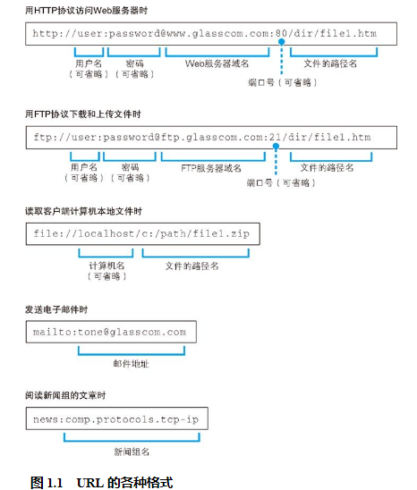
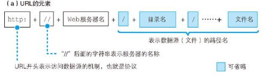
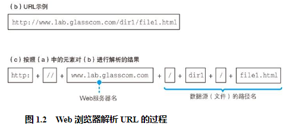
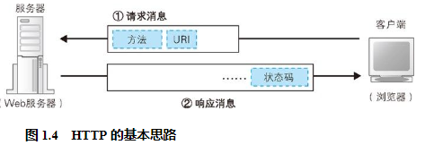
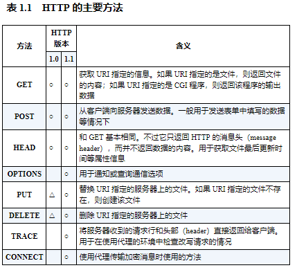
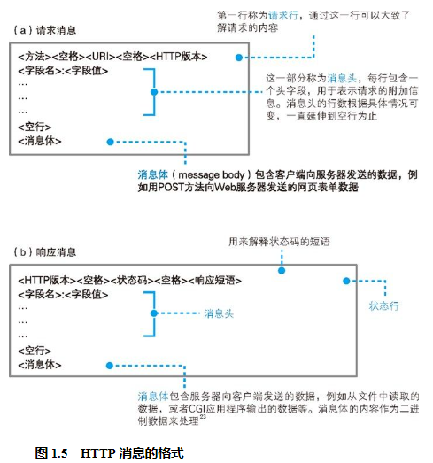
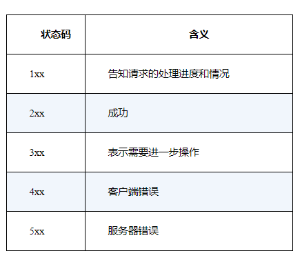

## 网址
网址，准确来说应该叫 URL
之所以有各种各样的 URL，是因为尽管我们通常是使用浏览器来访问 Web 服务器的，但实际上浏览器并不只有这一个功能，它也可以用来在 FTP5 服务器上下载和上传文件，同时也具备电子邮件客户端的功能。可以说，浏览器是一个具备多种客户端功能的综合性客户端软件，因此它需要一些东西来判断应该使用其中哪种功能来访问相应的数据，而各种不同的 URL 就是用来干这个的，比如访问 Web 服务器时用“http:”，而访问 FTP 服务器时用“ftp:”。

尽管 URL 有各种不同的写法，但它们有一个共同点，那就是 URL 开头的文字，即“http:”“ftp:”“file:”“mailto:”这部分文字都表示浏览器应当使用的访问方法。比如当访问 Web 服务器时应该使用 HTTP8 协议，而访问 FTP 服务器时则应该使用 FTP 协议。因此，我们可以把这部分理解为访问时使用的协议类型。

## 浏览器先要解析 URL
根据 HTTP 的规格，URL 包含图 1.2（a）中的这几种元素。当对 URL 进行解析时，首先需要按照图 1.2（a）的格式将其中的各个元素拆分出来，例如图 1.2（b）中的 URL 会拆分成图 1.2（c）的样子。然后，通过拆分出来的这些元素，我们就能够明白 URL 代表的含义。

## 省略文件名的情况
不过，没有文件名，服务器怎么知道要访问哪个文件呢？其实，我们会在服务器上事先设置好文件名省略时要访问的默认文件名。这个设置根据服务器不同而不同，大多数情况下是 index.html 或者 default.htm 之类的文件名。

## HTTP 的基本思路

HTTP 协议定义了客户端和服务器之间交互的消息内容和步骤，其基本思路非常简单。首先，客户端会向服务器发送请求消息（图 1.4）。请求消息中包含的内容是“对什么”和“进行怎样的操作”两个部分。其中相当于“对什么”的部分称为 URI 。一般来说，URI 的内容是一个存放网页数据的文件名或者是一个 CGI 程序 16 的文件名，例如“dir1file1.html”“dir1program1.cgi”等 17 。不过，URI 不仅限于此，也可以直接使用“http:”开头的 URL18 来作为 URI。换句话说就是，这里可以写各种访问目标，而这些访问目标统称为 URI。

相当于接下来“进行怎样的操作”的部分称为方法 19 。方法表示需要让 Web 服务器完成怎样的工作，其中典型的例子包括读取 URI 表示的数据、将客户端输入的数据发送给 URI 表示的程序等。

除了图 1.4 中的内容之外，HTTP 消息中还有一些用来表示附加信息的头字段。客户端向 Web 服务器发送数据时，会先发送头字段，然后再发送数据。

收到请求消息之后，Web 服务器会对其中的内容进行解析，通过 URI 和方法来判断“对什么”“进行怎样的操作”，并根据这些要求来完成自己的工作，然后将结果存放在响应消息中。在响应消息的开头有一个状态码，它用来表示操作的执行结果是成功还是发生了错误。

响应消息会被发送回客户端，客户端收到之后，浏览器会从消息中读出所需的数据并显示在屏幕上。到这里，HTTP 的整个工作就完成了。

## 生成 HTTP 请求消息

## 发送请求后会收到响应

在响应消息中，第一行的内容为状态码和响应短语，用来表示请求的执行结果是成功还是出错。状态码和响应短语表示的内容一致，但它们的用途不同。状态码是一个数字，它主要用来向程序告知执行的结果（表 1.3）；相对地，响应短语则是一段文字，用来向人们告知执行的结果。

当网页中包含图片时，会在网页中的相应位置嵌入表示图片文件的标签 27 的控制信息。浏览器会在显示文字时搜索相应的标签，当遇到图片相关的标签时，会在屏幕上留出用来显示图片的空间，然后再次访问 Web 服务器，按照标签中指定的文件名向 Web 服务器请求获取相应的图片并显示在预留的空间中。**由于每条请求消息中只能写 1 个 URI，所以每次只能获取 1 个文件，如果需要获取多个文件，必须对每个文件单独发送 1 条请求。**比如 1 个网页中包含 3 张图片，那么获取网页加上获取图片，一共需要向 Web 服务器发送 4 条请求。

判断所需的文件，然后获取这些文件并显示在屏幕上，这一系列工作的整体指挥也是浏览器的任务之一，而 Web 服务器却毫不知情。