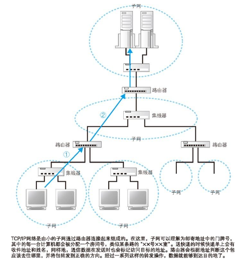
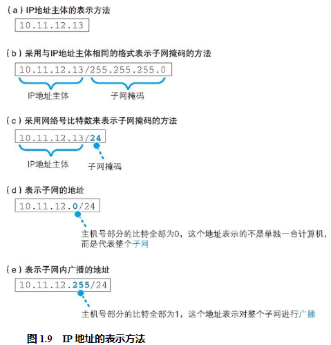
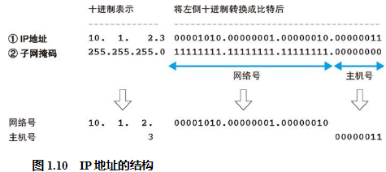
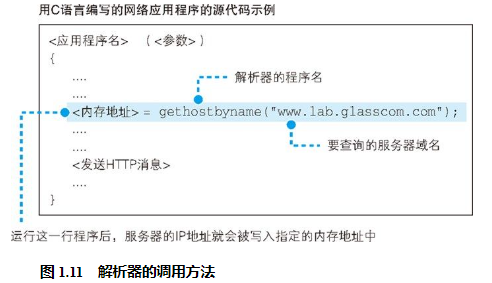
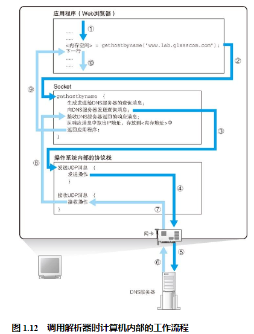

## IP地址的基本知识

生成 HTTP 消息之后，接下来我们需要委托操作系统将消息发送给 Web 服务器。尽管浏览器能够解析网址并生成 HTTP 消息，但它本身并不具备将消息发送到网络中的功能，因此这一功能需要委托操作系统来实现。在进行这一操作时，我们还有一个工作需要完成，那就是查询网址中服务器域名对应的 IP 地址。

互联网和公司内部的局域网都是基于 TCP/IP 的思路来设计的，所以我们先来了解 TCP/IP 的基本思路。TCP/IP 的结构如图 1.8 所示，就是由一些小的子网，通过路由器连接起来组成一个大的网络。这里的子网可以理解为用集线器连接起来的几台计算机，我们将它看作一个单位，称为子网。将子网通过路由器连接起来，就形成了一个网络。

在网络中，所有的设备都会被分配一个地址。这个地址就相当于现实中某条路上的“×× 号 ×× 室”。其中“号”对应的号码是分配给整个子网的，而“室”对应的号码是分配给子网中的计算机的，这就是网络中的地址。“号”对应的号码称为网络号，“室”对应的号码称为主机号，这个地址的整体称为 IP 地址。  

发送者发出的消息首先经过子网中的集线器，转发到距离发送者最近的路由器上（图 1.8 ①）。接下来，路由器会根据消息的目的地判断下一个路由器的位置，然后将消息发送到下一个路由器，即消息再次经过子网内的集线器被转发到下一个路由器（图 1.8 ②）。前面的过程不断重复，最终消息就被传送到了目的地。

如图 1.9 所示，实际的 IP 地址是一串 32 比特的数字，按照 8 比特（1 字节）为一组分成 4 组，分别用十进制表示然后再用圆点隔开。这就是我们平常经常见到的 IP 地址格式，但仅凭这一串数字我们无法区分哪部分是网络号，哪部分是主机号。在 IP 地址的规则中，网络号和主机号连起来总共是 32 比特，但这两部分的具体结构是不固定的。在组建网络时，用户可以自行决定它们之间的分配关系，因此，我们还需要另外的附加信息来表示 IP 地址的内部结构。

这一附加信息称为子网掩码。子网掩码的格式如图 1.10 ②所示，是一串与 IP 地址长度相同的 32 比特数字，其左边一半都是 1，右边一半都是 0。其中，子网掩码为 1 的部分表示网络号，子网掩码为 0 的部分表示主机号。将子网掩码按照和 IP 地址一样的方式以每 8 比特为单位用圆点分组后写在 IP 地址的右侧，这就是图 1.9（b）的方法。这种写法太长，我们也可以把 1 的部分的比特数用十进制表示并写在 IP 地址的右侧，如图 1.9（c） 所示。这两种方式只是写法上的区别，含义是完全一样的。

顺带一提，主机号部分的比特全部为 0 或者全部为 1 时代表两种特殊的含义。主机号部分全部为 0 代表整个子网而不是子网中的某台设备（图 1.9（d））。此外，主机号部分全部为 1 代表向子网上所有设备发送包，即广播（图 1.9（e））。

## 域名和 IP 地址并用的理由

然而，就像你很难记住电话号码一样，要记住一串由数字组成的 IP 地址也非常困难。因此，相比 IP 地址来说，网址中还是使用服务器名称比较好。

于是，现在我们使用的方案是让人来使用名称，让路由器来使用 IP 地址。为了填补两者之间的障碍，需要有一个机制能够通过名称来查询 IP 地址，或者通过 IP 地址来查询名称，这样就能够在人和机器双方都不做出牺牲的前提下完美地解决问题。这个机制就是 DNS。

## Socket 库提供查询 IP 地址的功能
对于 DNS 服务器，我们的计算机上一定有相应的 DNS 客户端，而相当于 DNS 客户端的部分称为 DNS 解析器，或者简称解析器。通过 DNS 查询 IP 地址的操作称为域名解析，因此负责执行解析（resolution）这一操作的就叫解析器（resolver）了。解析器实际上是一段程序，它包含在操作系统的 Socket 库中。

## 通过解析器向 DNS 服务器发出查询

调用解析器后，解析器会向 DNS 服务器发送查询消息，然后 DNS 服务器会返回响应消息。响应消息中包含查询到的 IP 地址，解析器会取出 IP 地址，并将其写入浏览器指定的内存地址中。只要运行图 1.11 中的这一行程序，就可以完成前面所有这些工作，我们也就完成了 IP 地址的查询。接下来，浏览器在向 Web 服务器发送消息时，只要从该内存地址取出 IP 地址，并将它与 HTTP 请求消息一起交给操作系统就可以了。

## 解析器的内部原理

当控制流程转移到解析器后，解析器会生成要发送给 DNS 服务器的查询消息。这个过程与浏览器生成要发送给 Web 服务器的 HTTP 请求消息的过程类似，解析器会根据 DNS 的规格，生成一条表示“请告诉我 www.lab.glasscom.com 的 IP 地址”43 的数据，并将它发送给 DNS 服务器（图 1.12 ③）。发送消息这个操作并不是由解析器自身来执行，而是要委托给操作系统内部的协议栈 44 来执行。这是因为和浏览器一样，解析器本身也不具备使用网络收发数据的功能。解析器调用协议栈后，控制流程会再次转移，协议栈会执行发送消息的操作，然后通过网卡将消息发送给 DNS 服务器（图 1.12 ④⑤）。

当 DNS 服务器收到查询消息后，它会根据消息中的查询内容进行查询。

总之，如果要访问的 Web 服务器已经在 DNS 服务器上注册，那么这条记录就能够被找到，然后其 IP 地址会被写入响应消息并返回给客户端（图 1.12 ⑥）。接下来，消息经过网络到达客户端，再经过协议栈被传递给解析器（图 1.12 ⑦⑧），然后解析器读取出消息取出 IP 地址，并将 IP 地址传递给应用程序（图 1.12 ⑨）。实际上，解析器会将取出的 IP 地址写入应用程序指定的内存地址中，图 1.11 用“< 内存地址 >”来表示，在实际的程序代码中应该写的是代表这一内存地址的名称。