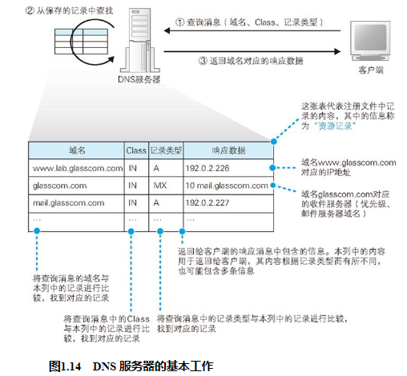
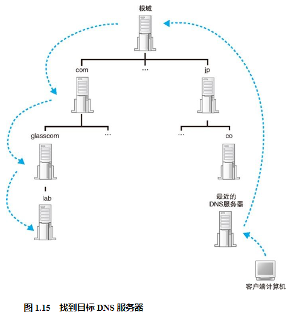

## DNS 服务器的基本工作
其中，来自客户端的查询消息包含以下 3 种信息。
（a）域名:服务器、邮件服务器（邮件地址中 @ 后面的部分）的名称
（b）Class:在最早设计 DNS 方案时，DNS 在互联网以外的其他网络中的应用也被考虑到了，而 Class 就是用来识别网络的信息。不过，如今除了互联网并没有其他的网络了，因此 Class 的值永远是代表互联网的 IN
（c）记录类型:表示域名对应何种类型的记录。例如，当类型为 A 时，表示域名对应的是 IP 地址；当类型为 MX 时，表示域名对应的是邮件服务器。对于不同的记录类型，服务器向客户端返回的信息也会不同

## 域名的层次结构

然而，互联网中存在着不计其数的服务器，将这些服务器的信息全部保存在一台 DNS 服务器中是不可能的，因此一定会出现在 DNS 服务器中找不到要查询的信息的情况。下面来看一看此时 DNS 服务器是如何工作的。

直接说答案的话很简单，就是将信息分布保存在多台 DNS 服务器中，这些 DNS 服务器相互接力配合，从而查找出要查询的信息。不过，这个机制其实有点复杂，因此我们先来看一看信息是如何在 DNS 服务器上注册并保存的。

首先，DNS 服务器中的所有信息都是按照域名以分层次的结构来保存的。

DNS 中的域名都是用句点来分隔的，比如 www.lab.glasscom.com，这里的句点代表了不同层次之间的界限，就相当于公司里面的组织结构不用部、科之类的名称来划分，只是用句点来分隔而已 49 。在域名中，越靠右的位置表示其层级越高，比如 www.lab.glasscom.com 这个域名如果按照公司里的组织结构来说，大概就是“com 事业集团 glasscom 部 lab 科的 www”这样。其中，相当于一个层级的部分称为域。因此，com 域的下一层是 glasscom 域，再下一层是 lab 域，再下面才是 www 这个名字。

这种具有层次结构的域名信息会注册到 DNS 服务器中，而每个域都是作为一个整体来处理的。换句话说就是，一个域的信息是作为一个整体存放在 DNS 服务器中的，不能将一个域拆开来存放在多台 DNS 服务器中。不过，DNS 服务器和域之间的关系也并不总是一对一的，一台 DNS 服务器中也可以存放多个域的信息。

这里再补充一点。对于公司域来说，例如现在需要为每一个事业集团配备一台 DNS 服务器，分别管理各事业集团自己的信息，但我们之前也说过一个域是不可分割的，这该怎么办呢？没关系，我们可以在域的下面创建下级域 51 ，然后再将它们分别分配给各个事业集团。比如，假设公司的域为 example.co.jp，我们可以在这个域的下面创建两个子域，即 sub1.example.co.jp 和 sub2.example.co.jp，然后就可以将这两个下级域分配给不同的事业集团来使用。

## 寻找相应的 DNS 服务器并获取 IP 地址

互联网中有数万台 DNS 服务器，肯定不能一台一台挨个去找。我们可以采用下面的办法。首先，将负责管理下级域的 DNS 服务器的 IP 地址注册到它们的上级 DNS 服务器中，然后上级 DNS 服务器的 IP 地址再注册到更上一级的 DNS 服务器中，以此类推。

在前面的讲解中，似乎 com、jp 这些域（称为顶级域）就是最顶层了，它们各自负责保存下级 DNS 服务器的信息，但实际上并非如此。在互联网中，com 和 jp 的上面还有一级域，称为根域。根域不像 com、jp 那样有自己的名字，因此在一般书写域名时经常被省略，如果要明确表示根域，应该像 www.lab.glasscom.com. 这样在域名的最后再加上一个句点，而这个最后的句点就代表根域。不过，一般都不写最后那个句点，因此根域的存在往往被忽略，但根域毕竟是真实存在的，根域的 DNS 服务器中保管着 com、jp 等的 DNS 服务器的信息。

除此之外还需要完成另一项工作，那就是将根域的 DNS 服务器信息保存在互联网中所有的 DNS 服务器中。这样一来，任何 DNS 服务器就都可以找到并访问根域 DNS 服务器了。因此，客户端只要能够找到任意一台 DNS 服务器，就可以通过它找到根域 DNS 服务器，然后再一路顺藤摸瓜找到位于下层的某台目标 DNS 服务器（图 1.15）。分配给根域 DNS 服务器的 IP 地址在全世界仅有 13 个 52 ，而且这些地址几乎不发生变化，因此将这些地址保存在所有的 DNS 服务器中也并不是一件难事。实际上，根域 DNS 服务器的相关信息已经包含在 DNS 服务器程序的配置文件中了，因此只要安装了 DNS 服务器程序，这些信息也就被自动配置好了。

## 通过缓存加快 DNS 服务器的响应

此外，有时候并不需要从最上级的根域开始查找，因为 DNS 服务器有一个缓存 53 功能，可以记住之前查询过的域名。如果要查询的域名和相关信息已经在缓存中，那么就可以直接返回响应，接下来的查询可以从缓存的位置开始向下进行。相比每次都从根域找起来说，缓存可以减少查询所需的时间。并且，当要查询的域名不存在时，“不存在”这一响应结果也会被缓存。这样，当下次查询这个不存在的域名时，也可以快速响应。这个缓存机制中有一点需要注意，那就是信息被缓存后，原本的注册信息可能会发生改变，这时缓存中的信息就有可能是不正确的。因此，DNS 服务器中保存的信息都设置有一个有效期，当缓存中的信息超过有效期后，数据就会从缓存中删除。而且，在对查询进行响应时，DNS 服务器也会告知客户端这一响应的结果是来自缓存中还是来自负责管理该域名的 DNS 服务器。