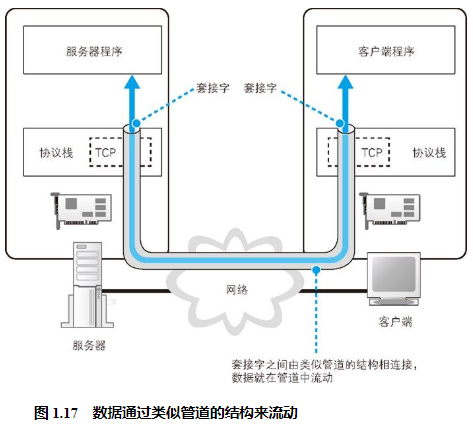
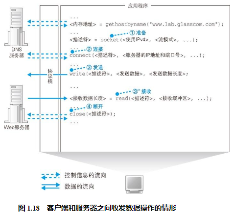

## 数据收发操作概览
使用 Socket 库来收发数据的操作过程如图 1.17 所示 55 。简单来说，收发数据的两台计算机之间连接了一条数据通道，数据沿着这条通道流动，最终到达目的地。我们可以把数据通道想象成一条管道，将数据从一端送入管道，数据就会到达管道的另一端然后被取出。数据可以从任何一端被送入管道，数据的流动是双向的。

收发数据的整体思路就是这样，但还有一点也非常重要。光从图上来看，这条管道好像一开始就有，实际上并不是这样，在进行收发数据操作之前，双方需要先建立起这条管道才行。建立管道的关键在于管道两端的数据出入口，这些出入口称为套接字。我们需要先创建套接字，然后再将套接字连接起来形成管道。实际的过程是下面这样的。首先，服务器一方先创建套接字，然后等待客户端向该套接字连接管道 56 。当服务器进入等待状态时，客户端就可以连接管道了。具体来说，客户端也会先创建一个套接字，然后从该套接字延伸出管道，最后管道连接到服务器端的套接字上。当双方的套接字连接起来之后，通信准备就完成了。接下来，就像我们刚刚讲过的一样，只要将数据送入套接字就可以收发数据了。

我们再来看一看收发数据操作结束时的情形。当数据全部发送完毕之后，连接的管道将会被断开。管道在连接时是由客户端发起的，但在断开时可以由客户端或服务器任意一方发起 57 。其中一方断开后，另一方也会随之断开，当管道断开后，套接字也会被删除。

## 创建套接字阶段

首先是套接字创建阶段。客户端创建套接字的操作非常简单，只要调用 Socket 库中的 socket 程序组件 58 就可以了（图 1.18 ①）。和调用解析器一样，调用 socket 之后，控制流程会转移到 socket 内部并执行创建套接字的操作，完成之后控制流程又会被移交回应用程序。

套接字创建完成后，协议栈会返回一个描述符，应用程序会将收到的描述符存放在内存中。描述符是用来识别不同的套接字的。

## 连接阶段：把管道接上去

接下来，我们需要委托协议栈将客户端创建的套接字与服务器那边的套接字连接起来。应用程序通过调用 Socket 库中的名为 connect 的程序组件来完成这一操作。这里的要点是当调用 connect 时，需要指定描述符、服务器 IP 地址和端口号这 3 个参数（图 1.18 ②）。

第 3 个参数，即端口号，这个需要稍微解释一下。可能大家会觉得， IP 地址就像电话号码，只要知道了电话号码不就可以联系到对方了吗？其实，网络通信和电话还是有区别的，我们先来看一看 IP 地址到底能用来干什么。IP 地址是为了区分网络中的各个计算机而分配的数值 61 。因此，只要知道了 IP 地址，我们就可以识别出网络上的某台计算机。但是，连接操作的对象是某个具体的套接字，因此必须要识别到具体的套接字才行，而仅凭 IP 地址是无法做到这一点的。我们打电话的时候，也需要通过“请帮我找一下某某某”这样的方式来找到具体的某个联系人，而端口号就是这样一种方式。当同时指定 IP 地址和端口号时，就可以明确识别出某台具体的计算机上的某个具体的套接字。

也许有人会说：“能不能用前面创建套接字时提到的那个描述符来识别套接字呢？”这种方法其实是行不通的，因为描述符是和委托创建套接字的应用程序进行交互时使用的，并不是用来告诉网络连接的另一方的，因此另一方并不知道这个描述符。同样地，客户端也无法知道服务器上的描述符。因此，客户端也无法通过服务器端的描述符去确定位于服务器上的某一个套接字。所以，我们需要另外一个对客户端也同样适用的机制，而这个机制就是端口号。**如果说描述符是用来在一台计算机内部识别套接字的机制，那么端口号就是用来让通信的另一方能够识别出套接字的机制。**

## 通信阶段：传递消息

## 断开阶段：收发数据结束

断开的过程如下。Web 使用的 HTTP 协议规定，当 Web 服务器发送完响应消息之后，应该主动执行断开操作 68 ，因此 Web 服务器会首先调用 close 来断开连接。断开操作传达到客户端之后，客户端的套接字也会进入断开阶段。接下来，当浏览器调用 read 执行接收数据操作时，read 会告知浏览器收发数据操作已结束，连接已经断开。浏览器得知后，也会调用 close 进入断开阶段。

这就是 HTTP 的工作过程。HTTP 协议将 HTML 文档和图片都作为单独的对象来处理，每获取一次数据，就要执行一次连接、发送请求消息、接收响应消息、断开的过程。因此，如果一个网页中包含很多张图片，就必须重复进行很多次连接、收发数据、断开的操作。对于同一台服务器来说，重复连接和断开显然是效率很低的，因此后来人们又设计出了能够在一次连接中收发多个请求和响应的方法。在 HTTP 版本 1.1 中就可以使用这种方法，在这种情况下，当所有数据都请求完成后，浏览器会主动触发断开连接的操作。