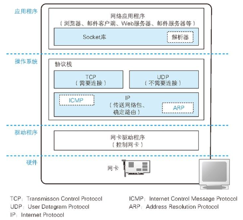
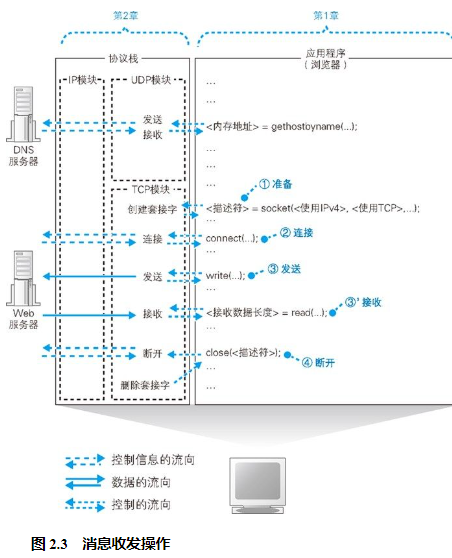

## 套接字的实体就是通信控制信息

在协议栈内部有一块用于存放控制信息的内存空间，这里记录了用于控制通信操作的控制信息，例如通信对象的 IP 地址、端口号、通信操作的进行状态等。本来套接字就只是一个概念而已，并不存在实体，如果一定要赋予它一个实体，我们可以说这些控制信息就是套接字的实体，或者说存放控制信息的内存空间就是套接字的实体。

## 调用 socket 时的操作

首先是创建套接字的阶段。如图 2.3 ①所示，应用程序调用 socket 申请创建套接字，协议栈根据应用程序的申请执行创建套接字的操作。在这个过程中，协议栈首先会分配用于存放一个套接字所需的内存空间。用于记录套接字控制信息的内存空间并不是一开始就存在的，因此我们先要开辟出这样一块空间来，这相当于为控制信息准备一个容器。但光一个容器并没有什么用，还需要往里面存入控制信息。