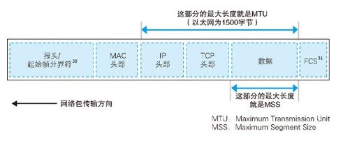
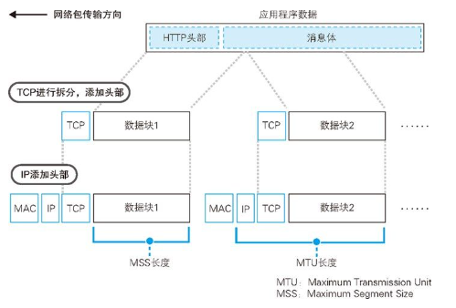
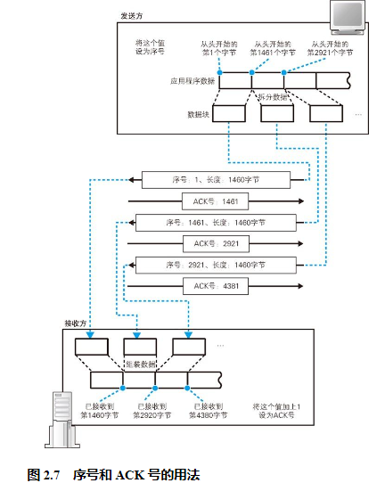
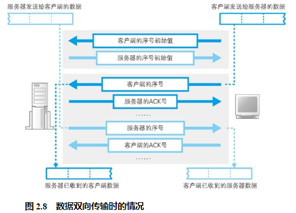
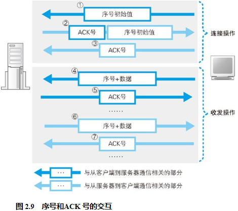
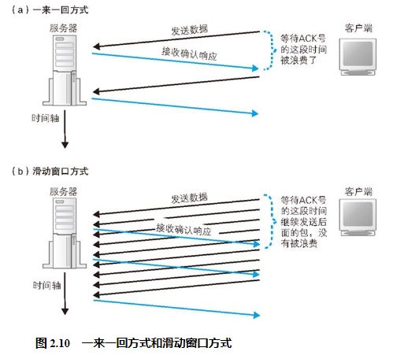

## 将 HTTP 请求消息交给协议栈

首先，协议栈并不关心应用程序传来的数据是什么内容。应用程序在调用 write 时会指定发送数据的长度，在协议栈看来，要发送的数据就是一定长度的二进制字节序列而已。

其次，协议栈并不是一收到数据就马上发送出去，而是会将数据存放在内部的发送缓冲区中，并等待应用程序的下一段数据。这样做是有道理的。应用程序交给协议栈发送的数据长度是由应用程序本身来决定的，不同的应用程序在实现上有所不同，有些程序会一次性传递所有的数据，有些程序则会逐字节或者逐行传递数据。总之，一次将多少数据交给协议栈是由应用程序自行决定的，协议栈并不能控制这一行为。在这样的情况下，如果一收到数据就马上发送出去，就可能会发送大量的小包，导致网络效率下降，因此需要在数据积累到一定量时再发送出去。至于要积累多少数据才能发送，不同种类和版本的操作系统会有所不同，不能一概而论，但都是根据下面几个要素来判断的。

第一个判断要素是每个网络包能容纳的数据长度，协议栈会根据一个叫作 MTU27 的参数来进行判断。MTU 表示一个网络包的最大长度，在以太网中一般是 1500 字节（图 2.5）。MTU 是包含头部的总长度，因此需要从 MTU 减去头部的长度，然后得到的长度就是一个网络包中所能容纳的最大数据长度，这一长度叫作 MSS。当从应用程序收到的数据长度超过或者接近 MSS 时再发送出去，就可以避免发送大量小包的问题了。

另一个判断要素是时间。当应用程序发送数据的频率不高的时候，如果每次都等到长度接近 MSS 时再发送，可能会因为等待时间太长而造成发送延迟，这种情况下，即便缓冲区中的数据长度没有达到 MSS，也应该果断发送出去。为此，协议栈的内部有一个计时器，当经过一定时间之后，就会把网络包发送出去。

判断要素就是这两个，但它们其实是互相矛盾的。如果长度优先，那么网络的效率会提高，但可能会因为等待填满缓冲区而产生延迟；相反地，如果时间优先，那么延迟时间会变少，但又会降低网络的效率。因此，在进行发送操作时需要综合考虑这两个要素以达到平衡。不过，TCP 协议规格中并没有告诉我们怎样才能平衡，因此实际如何判断是由协议栈的开发者来决定的，也正是由于这个原因，不同种类和版本的操作系统在相关操作上也就存在差异。

## 对较大的数据进行拆分

## 使用 ACK 号确认网络包已收到

我们先来看一下确认的原理（图 2.7）。首先，TCP 模块在拆分数据时，会先算好每一块数据相当于从头开始的第几个字节，接下来在发送这一块数据时，将算好的字节数写在 TCP 头部中，“序号”字段就是派在这个用场上的。然后，发送数据的长度也需要告知接收方，不过这个并不是放在 TCP 头部里面的，因为用整个网络包的长度减去头部的长度就可以得到数据的长度，所以接收方可以用这种方法来进行计算。有了上面两个数值，我们就可以知道发送的数据是从第几个字节开始，长度是多少了。

因此，网卡、集线器、路由器都没有错误补偿机制，一旦检测到错误就直接丢弃相应的包。应用程序也是一样，因为采用 TCP 传输，即便发生一些错误对方最终也能够收到正确的数据，所以应用程序只管自顾自地发送这些数据就好了。不过，如果发生网络中断、服务器宕机等问题，那么无论 TCP 怎样重传都不管用。这种情况下，无论如何尝试都是徒劳，因此 TCP 会在尝试几次重传无效之后强制结束通信，并向应用程序报错。

## 根据网络包平均往返时间调整 ACK 号等待时间

当网络传输繁忙时就会发生拥塞，ACK 号的返回会变慢，这时我们就必须将等待时间设置得稍微长一点，否则可能会发生已经重传了包之后，前面的 ACK 号才姗姗来迟的情况。这样的重传是多余的，看上去只是多发一个包而已，但它造成的后果却没那么简单。因为 ACK 号的返回变慢大多是由于网络拥塞引起的，因此如果此时再出现很多多余的重传，对于本来就很拥塞的网络来说无疑是雪上加霜。那么等待时间是不是越长越好呢？也不是。如果等待时间过长，那么包的重传就会出现很大的延迟，也会导致网络速度变慢。

## 使用窗口有效管理 ACK 号

## ACK 与窗口的合并

## 接收 HTTP 响应消息