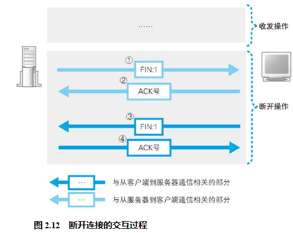

## 数据发送完毕后断开连接

毫无疑问，收发数据结束的时间点应该是应用程序判断所有数据都已经发送完毕的时候。这时，数据发送完毕的一方会发起断开过程，但不同的应用程序会选择不同的断开时机。以 Web 为例，浏览器向 Web 服务器发送请求消息，Web 服务器再返回响应消息，这时收发数据的过程就全部结束了，服务器一方会发起断开过程。当然，可能也有一些程序是客户端发送完数据就结束了，不用等服务器响应，这时客户端会先发起断开过程。这一判断是应用程序作出的，协议栈在设计上允许任何一方先发起断开过程。

## 删除套接字

和服务器的通信结束之后，用来通信的套接字也就不会再使用了，这时我们就可以删除这个套接字了。不过，套接字并不会立即被删除，而是会等待一段时间之后再被删除。等待这段时间是为了防止误操作，引发误操作的原因有很多

至于具体等待多长时间，这和包重传的操作方式有关。网络包丢失之后会进行重传，这个操作通常要持续几分钟。如果重传了几分钟之后依然无效，则停止重传。在这段时间内，网络中可能存在重传的包，也就有可能发生前面讲到的这种误操作，因此需要等待到重传完全结束。协议中对于这个等待时间没有明确的规定，一般来说会等待几分钟之后再删除套接字。