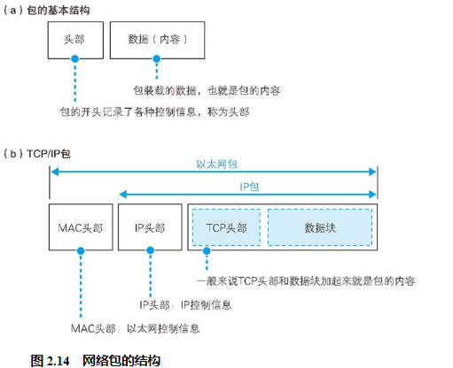
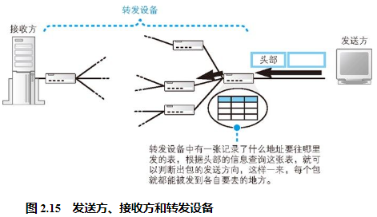
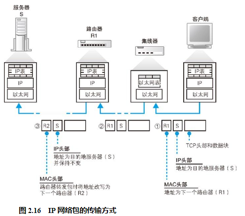
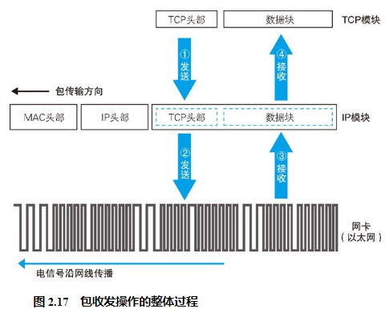
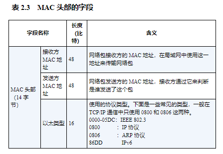
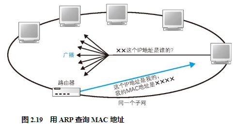
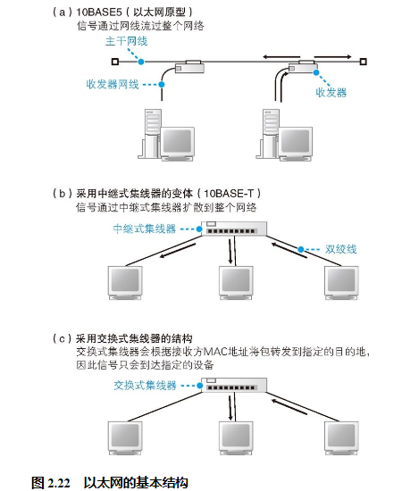
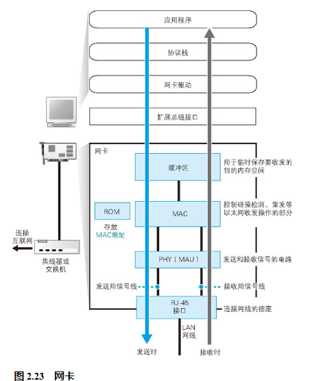
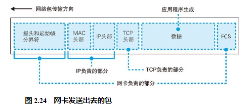

## 包的基本知识

首先，包是由头部和数据两部分构成的（图 2.14（a））。头部包含目的地址等控制信息，大家可以把它理解为快递包裹的面单；头部后面就是委托方要发送给对方的数据，也就相当于快递包裹里的货物。一个包发往目的地的过程如图 2.15 所示。

在第 1 章 1.2.1 节，我们讲过子网的概念，还讲过网络中有路由器和集线器两种不同的转发设备，它们在传输网络包时有着各自的分工。（1）路由器根据目标地址判断下一个路由器的位置（2）集线器在子网中将网络包传输到下一个路由

实际上，集线器是按照以太网规则传输包的设备，而路由器是按照 IP 规则传输包的设备，因此我们也可以作如下理解。（1）IP 协议根据目标地址判断下一个 IP 转发设备的位置（2）子网中的以太网协议将包传输到下一个转发设备

具体来说，如图 2.14（b）所示，TCP/IP 包包含如下两个头部。（a）MAC 头部（用于以太网协议）（b）IP 头部（用于 IP 协议）

这两个头部分别具有不同的作用。首先，发送方将包的目的地，也就是要访问的服务器的 IP 地址写入 IP 头部中。这样一来，我们就知道这个包应该发往哪里，IP 协议就可以根据这一地址查找包的传输方向，从而找到下一个路由器的位置，也就是图 2.16 中的路由器 R1。接下来，IP 协议会委托以太网协议将包传输过去。这时，IP 协议会查找下一个路由器的以太网地址（MAC 地址），并将这个地址写入 MAC 头部中。这样一来，以太网协议就知道要将这个包发到哪一个路由器上了。

网络包在传输过程中（图 2.16 ①）会经过集线器，集线器是根据以太网协议工作的设备。为了判断包接下来应该向什么地方传输，集线器里有一张表（用于以太网协议的表），可根据以太网头部中记录的目的地信息查出相应的传输方向。这张图中只有一个集线器，当存在多个集线器时，网络包会按顺序逐一通过这些集线器进行传输。

接下来，包会到达下一个路由器（图 2.16 ②）。路由器中有一张 IP 协议的表，可根据这张表以及 IP 头部中记录的目的地信息查出接下来应该发往哪个路由器。为了将包发到下一个路由器，我们还需要查出下一个路由器的 MAC 地址，并记录到 MAC 头部中，大家可以理解为改写了 MAC 头部 53 。这样，网络包就又被发往下一个节点了。

## 包收发操作概览

包收发操作的起点是 TCP 模块委托 IP 模块发送包的操作（图 2.17 中的“①发送”）。这个委托的过程就是 TCP 模块在数据块的前面加上 TCP 头部，然后整个传递给 IP 模块，这部分就是网络包的内容。与此同时， TCP 模块还需要指定通信对象的 IP 地址，也就是需要写清楚“将什么内容发给谁”。

收到委托后，IP 模块会将包的内容当作一整块数据，在前面加上包含控制信息的头部。

接下来，封装好的包会被交给网络硬件（图 2.17 中的“②发送”），例如以太网、无线局域网等。

传递给网卡的网络包是由一连串 0 和 1 组成的数字信息，网卡会将这些数字信息转换为电信号或光信号，并通过网线（或光纤）发送出去，然后这些信号就会到达集线器、路由器等转发设备，再由转发设备一步一步地送达接收方。

包送达对方之后，对方会作出响应。返回的包也会通过转发设备发送回来，然后我们需要接收这个包。接收的过程和发送的过程是相反的，信息先以电信号的形式从网线传输进来，然后由网卡将其转换为数字信息并传递给 IP 模块（图 2.17 中的“③接收”）。接下来，IP 模块会将 MAC 头部和 IP 头部后面的内容，也就是 TCP 头部加上数据块，传递给 TCP 模块。接下来的操作就是我们之前讲过的 TCP 模块负责的部分了。

## 生成包含接收方 IP 地址的 IP 头部

IP 模块接受 TCP 模块的委托负责包的收发工作，它会生成 IP 头部并附加在 TCP 头部前面。IP 头部包含的内容如表 2.2 所示，其中最重要的内容就是 IP 地址，它表示这个包应该发到哪里去。这个地址是由 TCP 模块告知的，而 TCP 又是在执行连接操作时从应用程序那里获得这个地址的，因此这个地址的最初来源就是应用程序。IP 不会自行判断包的目的地，而是将包发往应用程序指定的接收方，即便应用程序指定了错误的 IP 地址，IP 模块也只能照做。当然，这样做肯定会出错，但这个责任应该由应用程序来承担。

IP 头部中还需要填写发送方的 IP 地址，大家可以认为是发送方计算机的 IP 地址.

因为协议栈的 IP 模块与路由器中负责包收发的部分都是根据 IP 协议规则来进行包收发操作的，所以它们也都用相同的方法来判断把包发送给谁。

## 生成以太网用的 MAC 头部

生成了 IP 头部之后，接下来 IP 模块还需要在 IP 头部的前面加上 MAC 头部（表 2.3）。IP 头部中的接收方 IP 地址表示网络包的目的地，通过这个地址我们就可以判断要将包发到哪里，但在以太网的世界中，TCP/ IP 的这个思路是行不通的。以太网在判断网络包目的地时和 TCP/IP 的方式不同，因此必须采用相匹配的方式才能在以太网中将包发往目的地，而 MAC 头部就是干这个用的。

前面这些还比较简单，而接收方 MAC 地址就有点复杂了。只要告诉以太网对方的 MAC 的地址，以太网就会帮我们把包发送过去，那么很显然这里应该填写对方的 MAC 地址。然而，在这个时间点上，我们还没有把包发送出去，所以先得搞清楚应该把包发给谁，这个只要查一下路由表就知道了。在路由表中找到相匹配的条目，然后把包发给 Gateway 列中的 IP 地址就可以了。

既然已经知道了包应该发给谁，那么只要将对方的 MAC 地址填上去就好了，但到这里为止根本没有出现对方的 MAC 地址，也就是说我们现在根本不知道对方的 MAC 地址是什么。因此，我们还需要执行根据 IP 地址查询 MAC 地址的操作。

## 通过 ARP 查询目标路由器的 MAC 地址

如果对方和自己处于同一个子网中，那么通过上面的操作就可以得到对方的 MAC 地址。然后，我们将这个 MAC 地址写入 MAC 头部，MAC 头部就完成了。

不过，如果每次发送包都要这样查询一次，网络中就会增加很多 ARP 包，因此我们会将查询结果放到一块叫作 ARP 缓存的内存空间中留着以后用。

有了 ARP 缓存，我们可以减少 ARP 包的数量，但如果总是使用 ARP 缓存中保存的地址也会产生问题。例如当 IP 地址发生变化时，ARP 缓存的内容就会和现实发生差异。为了防止这种问题的发生，ARP 缓存中的值在经过一段时间后会被删除，一般这个时间在几分钟左右。这个删除的操作非常简单粗暴，不管 ARP 缓存中的内容是否有效，只要经过几分钟就全部删掉，这样就不会出问题了。当地址从 ARP 缓存中删除后，只要重新执行一次 ARP 查询就可以再次获得地址了。

## 以太网的基本知识

太网是一种为多台计算机能够彼此自由和廉价地相互通信而设计的通信技术，它的原型如图 2.22（a）所示。从图上不难看出，这种网络的本质其实就是一根网线。

图上还有一种叫作收发器的小设备，它的功能只是将不同网线之间的信号连接起来而已。因此，当一台计算机发送信号时，信号就会通过网线流过整个网络，最终到达所有的设备。这就好像所有人待在一个大房间里，任何一个人说话，所有人都能够听到，同样地，这种网络中任何一台设备发送的信号所有设备都能接收到。不过，我们无法判断一个信号到底是发给谁的，因此需要在信号的开头加上接收者的信息，也就是地址。这样一来就能够判断信号的接收者了，与接收者地址匹配的设备就接收这个包，其他的设备则丢弃这个包，这样我们的包就送到指定的目的地了。为了控制这一操作，我们就需要使用表 2.3 中列出的 MAC 头部。通过 MAC 头部中的接收方 MAC 地址，就能够知道包是发给谁的；而通过发送方 MAC 地址，就能够知道包是谁发出的；

## 将 IP 包转换成电或光信号发送出去

下面来看看以太网的包收发操作。IP 生成的网络包只是存放在内存中的一串数字信息，没有办法直接发送给对方。因此，我们需要将数字信息转换为电或光信号，才能在网线上传输，也就是说，这才是真正的数据发送过程。

网卡并不是通上电之后就可以马上开始工作的，而是和其他硬件一样，都需要进行初始化。也就是说，打开计算机启动操作系统的时候，网卡驱动程序会对硬件进行初始化操作，然后硬件才进入可以使用的状态。这些操作包括硬件错误检查、初始设置等步骤，这些步骤对于很多其他硬件也是共通的，但也有一些操作是以太网特有的，那就是在控制以太网收发操作的 MAC82 模块中设置 MAC 地址。

网卡驱动从 IP 模块获取包之后，会将其复制到网卡内的缓冲区中，然后向 MAC 模块发送发送包的命令。接下来就轮到 MAC 模块进行工作了。

首先，MAC 模块会将包从缓冲区中取出，并在开头加上报头和起始帧分界符，在末尾加上用于检测错误的帧校验序列（图 2.24）。

## 向集线器发送网络包

## 接收返回包