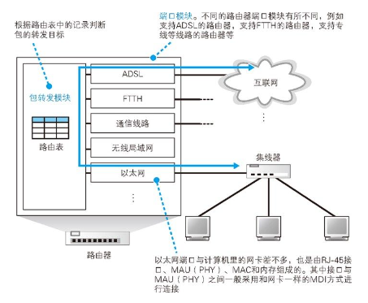
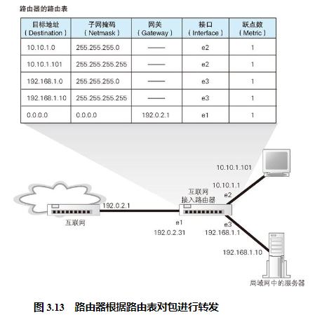
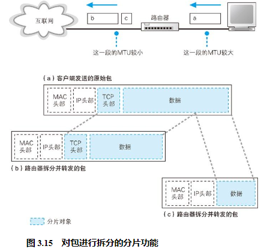

## 路由器的基本知识

网络包经过集线器和交换机之后，现在到达了路由器，并在此被转发到下一个路由器。这一步转发的工作原理和交换机类似，也是通过查表判断包转发的目标。不过在具体的操作过程上，路由器和交换机是有区别的。因为路由器是基于 IP 设计的，而交换机是基于以太网设计的。

路由器在转发包时，首先会通过端口将发过来的包接收进来，这一步的工作过程取决于端口对应的通信技术。对于以太网端口来说，就是按照以太网规范进行工作，而无线局域网端口则按照无线局域网的规范工作，总之就是委托端口的硬件将包接收进来。接下来，转发模块会根据接收到的包的 IP 头部中记录的接收方 IP 地址，在路由表中进行查询，以此判断转发目标。然后，转发模块将包转移到转发目标对应的端口，端口再按照硬件的规则将包

## 路由表中的信息

在“查表判断转发目标”这一点上，路由器和交换机的大体思路是类似的，不过具体的工作过程有所不同。交换机是通过 MAC 头部中的接收方 MAC 地址来判断转发目标的，而路由器则是根据 IP 头部中的 IP 地址来判断的。由于使用的地址不同，记录转发目标的表的内容也会不同。

## 路由器的包接收操作

首先，信号到达网线接口部分，其中的 PHY（MAU）模块和 MAC 模块将信号转换为数字信息，然后通过包末尾的 FCS 进行错误校验，如果没问题则检查 MAC 头部中的接收方 MAC 地址，看看是不是发给自己的包，如果是就放到接收缓冲区中，否则就丢弃这个包。

## 查询路由表确定输出端口

完成包接收操作之后，路由器就会丢弃包开头的 MAC 头部。MAC 头部的作用就是将包送达路由器，其中的接收方 MAC 地址就是路由器端口的 MAC 地址。因此，当包到达路由器之后，MAC 头部的任务就完成了，于是 MAC 头部就会被丢弃。

接下来，路由器会根据 MAC 头部后方的 IP 头部中的内容进行包的转发操作。转发操作分为几个阶段，首先是查询路由表判断转发目标。

## 找不到匹配路由时选择默认路由

## 包的有效期

路由表中查找到转发目标之后，网络包就会被转交给输出端口，并最终发送出去，但在此之前，路由器还有一些工作要完成。

第一个工作是更新 IP 头部中的 TTL（Timeto Live，生存时间）字段（参见第 2 章的表 2.2）。TTL 字段表示包的有效期，包每经过一个路由器的转发，这个值就会减 1，当这个值变成 0 时，就表示超过了有效期，这个包就会被丢弃。

## 通过分片功能拆分大网络包

路由器的端口并不只有以太网一种，也可以支持其他局域网或专线通信技术。不同的线路和局域网类型各自能传输的最大包长度也不同，因此输出端口的最大包长度可能会小于输入端口。即便两个端口的最大包长度相同，也可能会因为添加了一些头部数据而导致包的实际长度发生变化，ADSL、FTTH 等宽带接入技术中使用的 PPPoE协议就属于这种情况。无论哪种情况，一旦转发的包长度超过了输出端口能传输的最大长度，就无法直接发送这个包了。

遇到这种情况，可以使用 IP 协议中定义的分片功能对包进行拆分，缩短每个包的长度。

## 路由器的发送操作和计算机相同

## 路由器与交换机的关系