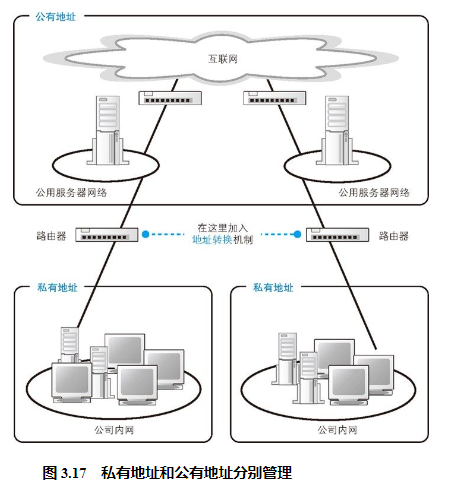
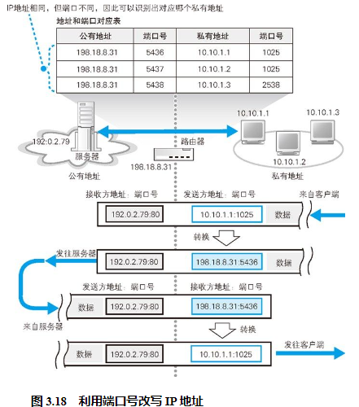
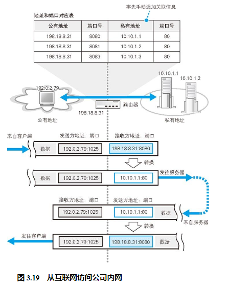

## 通过地址转换有效利用 IP 地址

刚才我们介绍了路由器的基本工作过程，现在的路由器除了这些基本功能之外，还有一些附加功能。下面来介绍两种最重要的功能——地址转换和包过滤。

在制定私有地址规则时，这些地址属于公有地址中还没有分配的范围。换句话说，私有地址本身并没有什么特别的结构，只不过是将公有地址中没分配的一部分拿出来规定只能在内网使用它们而已。这个范围中的地址和其他公司重复也没关系，所以对于这些地址不作统一管理，不需要申请，任何人都可以自由使用。当然，如果在公司内部地址有重复就无法传输网络包了，因此必须避免在内网中出现重复的地址。

尽管这样的确能节省一部分地址，但仅凭这一点还无法完全解决问题。公司内网并不是完全独立的，而是需要通过互联网和其他很多公司相连接，所以当内网和互联网之间需要传输包的时候，问题就出现了，因为如果很多地方都出现相同的地址，包就无法正确传输了。

于是，当公司内网和互联网连接的时候，需要采用图 3.17 这样的结构，即将公司内网分成两个部分，一部分是对互联网开放的服务器，另一部分是公司内部设备。其中对互联网开放的部分分配公有地址，可以和互联网直接进行通信，这一部分和之前介绍的内容是一样的。相对地，内网部分则分配私有地址，内网中的设备不能和互联网直接收发网络包，而是通过一种特别的机制进行连接，这个机制就叫地址转换。

## 地址转换的基本原理

地址转换的基本原理是在转发网络包时对 IP 头部中的 IP 地址和端口号进行改写。

首先，TCP 连接操作的第一个包被转发到互联网时，会像图 3.18 这样，将发送方 IP 地址从私有地址改写成公有地址。这里使用的公有地址是地址转换设备的互联网接入端口的地址。与此同时，端口号也需要进行改写，地址转换设备会随机选择一个空闲的端口。然后，改写前的私有地址和端口号，以及改写后的公有地址和端口号，会作为一组相对应的记录保存在地址转换设备内部的一张表中。

## 改写端口号的原因

改写端口号正是为了解决这个问题。客户端一方的端口号本来就是从空闲端口中随机选择的，因此改写了也不会有问题。端口号是一个 16 比特的数值，总共可以分配出几万个端口，因此如果用公有地址加上端口的组合对应一个私有地址，一个公有地址就可以对应几万个私有地址，这种方法提高了公有地址的利用率。

## 从互联网访问公司内网

换个角度来看，这意味着对于没有在访问互联网的内网设备，是无法从互联网向其发送网络包的。而且即便是正在访问的设备，也只能向和互联网通信中使用的那个端口发送网络包，无法向其他端口发送包。也就是说，除非公司主动允许，否则是无法从互联网向公司内网发送网络包的。这种机制具有防止非法入侵的效果。

不过，有时候我们希望能够从互联网访问公司内网，这需要进行一些设置才能实现。之所以无法从互联网访问内网，是因为对应表里没有相应的记录，那么我们只要事先手动添加这样的记录就可以了（图 3.19）。一般来说，用于外网访问的服务器可以放在地址转换设备的外面并为它分配一个公有地址，也可以将服务器的私有地址手动添加到地址转换设备中，这样就可以从互联网访问到这台具有私有地址的服务器了。

## 路由器的包过滤功能

包过滤就是在对包进行转发时，根据 MAC 头部、IP 头部、TCP 头部的内容，按照事先设置好的规则决定是转发这个包，还是丢弃这个包。我们通常说的防火墙设备或软件，大多数都是利用这一机制来防止非法入侵的。

包过滤的原理非常简单，但要想设置一套恰当的规则来区分非法访问和正常访问，只阻止非法入侵而不影响正常访问，是非常不容易的。