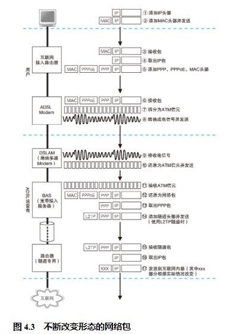

## 互联网的基本结构和家庭、公司网络是相同的

距离的不同和路由的维护方式，就是互联网与家庭、公司网络之间最主要的两个不同点。

## 连接用户与互联网的接入网

刚才讲过，路由器的转发操作都是相同的，因此互联网接入路由器的包转发操作也和第 3 章讲过的以太网路由器几乎是一样的。简单来说，就是根据包 IP 头部中的接收方 IP 地址在路由表的目标地址中进行匹配，找到相应的路由记录后将包转发到这条路由的目标网关。不过，互联网接入路由器发送网络包的操作和以太网路由器有一点不同，互联网接入路由器是按照接入网规则来发送包的。

所谓接入网，就是指连接互联网与家庭、公司网络的通信线路 4 。一般家用的接入网方式包括 ADSL5 、FTTH6 、CATV、电话线、ISDN 等，公司则还可能使用专线。接入网的线路有很多种类，我们无法探索所有这些线路，因此下面先介绍一个比较有代表性的例子——ADSL。

## ADSL Modem 将包拆分成信元】

## ADSL 将信元“调制”成信号