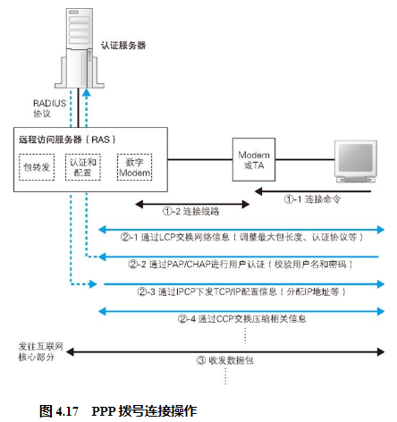

## 用户认证和配置下发

首先是用户认证和配置下发功能。ADSL 和 FTTH 接入网中，都需要先输入用户名和密码，登录之后才能访问互联网，而 BAS 就是登录操作的窗口。BAS 使用 PPPoE方式来实现这个功能 。PPPoE 是由传统电话拨号上网上使用的 PPP 协议发展而来的，所以我们先来看一看 PPP 拨号上网的工作方式。

## 在以太网上传输 PPP 消息  

## 通过隧道将网络包发送给运营商