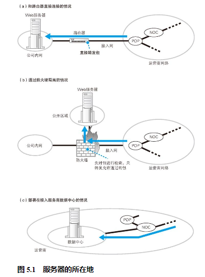

## 在公司里部署 Web 服务器

网络包从互联网到达服务器的过程，根据服务器部署地点的不同而不同。最简单的是图 5.1（a）中的这种情况，服务器直接部署在公司网络上，并且可以从互联网直接访问。这种情况下，网络包通过最近的 POP 中的路由器、接入网以及服务器端路由器之后，就直接到达了服务器。其中，路由器的包转发操作，以及接入网和局域网中包的传输过程都和我们之前讲过的内容没有区别。

以前这样的服务器部署方式很常见，但现在已经不是主流方式了。这里有几个原因。第一个原因是 IP 地址不足。这样的方式需要为公司网络中的所有设备，包括服务器和客户端计算机，都分配各自的公有地址。然而现在公有地址已经不够用了，因此采用这种方式已经不现实了。

另一个原因是安全问题。这种方式中，从互联网传来的网络包会无节制地进入服务器，这意味着服务器在攻击者看来处于“裸奔”状态。当然，我们可以强化服务器本身的防御来抵挡攻击，这样可以一定程度上降低风险。但是，任何设置失误都会产生安全漏洞，而裸奔状态的服务器，其安全漏洞也都会暴露出来。人工方式总会出错，安全漏洞很难完全消除，因此让服务器裸奔并不是一个稳妥的办法。

因此，现在我们一般采用图 5.1（b）中的方式，即部署防火墙。防火墙的作用类似于海关，它只允许发往指定服务器的指定应用程序的网络包通过，从而屏蔽其他不允许通过的包。这样一来，即便应用程序存在安全漏洞，也可以降低相应的风险。因为防火墙屏蔽了不允许从外部访问的应用程序，所以即便这些程序存在安全漏洞，用于攻击的网络包也进不来。当然，即便如此风险也不会降到零，因为如果允许外部访问的应用程序中有安全漏洞，还是有可能遭到攻击的，但怎么说也远比完全暴露安全漏洞的风险要低得多。这就是防火墙的作用。

## 将 Web 服务器部署在数据中心

数据中心是与运营商核心部分 NOC 直接连接的，或者是与运营商之间的枢纽 IX 直接连接的。换句话说，数据中心通过高速线路直接连接到互联网的核心部分，因此将服务器部署在这里可以获得很高的访问速度 5 ，当服务器访问量很大时这是非常有效的。此外，数据中心一般位于具有抗震结构的大楼内，还具有自主发电设备，并实行 24 小时门禁管理，可以说比放在公司里具有更高的安全性。此外，数据中心不但提供安放服务器的场地，还提供各种附加服务，如服务器工作状态监控、防火墙的配置和运营、非法入侵监控等，从这一点来看，其安全性也更高。