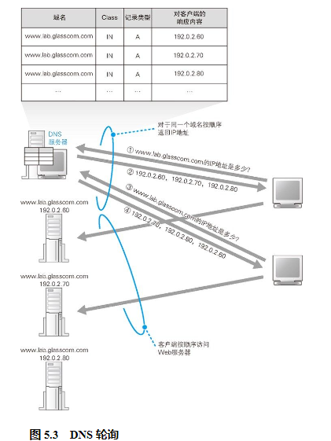
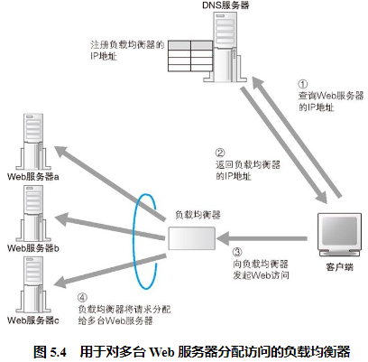

## 性能不足时需要负载均衡

在这种情况下，使用多台服务器来分担负载的方法更有效。这种架构统称为分布式架构，其中对于负载的分担有几种方法，最简单的一种方法就是采用多台 Web 服务器，减少每台服务器的访问量。假设现在我们有 3 台服务器，那么每台服务器的访问量会减少到三分之一，负载也就减轻了。要采用这样的方法，必须有一个机制将客户端发送的请求分配到每台服务器上。具体的做法有很多种，最简单的一种是通过 DNS 服务器来分配。当访问服务器时，客户端需要先向 DNS 服务器查询服务器的 IP 地址，如果在 DNS 服务器中填写多个名称相同的记录，则每次查询时 DNS 服务器都会按顺序返回不同的 IP 地址。

但这种方式是有缺点的。假如多台 Web 服务器中有一台出现了故障，这时我们希望在返回 IP 地址时能够跳过故障的 Web 服务器，然而普通的 DNS 服务器并不能确认 Web 服务器是否正常工作，因此即便 Web 服务器宕机了，它依然可能会返回这台服务器的 IP 地址。

此外，轮询分配还可能会引发一些问题。在通过 CGI 等方式动态生成网页的情况下，有些操作是要跨多个页面的，如果这期间访问的服务器发生了变化，这个操作就可能无法继续。例如在购物网站中，可能会在第一个页面中输入地址和姓名，在第二个页面中输入信用卡号，这就属于刚才说的那种情况。

## 使用负载均衡器分配访问

为了避免出现前面的问题，可以使用一种叫作负载均衡器的设备。使用负载均衡器时，首先要用负载均衡器的 IP 地址代替 Web 服务器的实际地址注册到 DNS 服务器上。假设有一个域名 www.lab.glasscom.com，我们将这个域名对应的 IP 地址设置为负载均衡器的 IP 地址并注册到 DNS 服务器上。于是，客户端会认为负载均衡器就是一台 Web 服务器，并向其发送请求，然后由负载均衡器来判断将请求转发给哪台 Web 服务器。这里的关键点不言而喻，那就是如何判断将请求转发给哪台 Web 服务器。

断条件有很多种，根据操作是否跨多个页面，判断条件也会有所不同。如果操作没有跨多个页面，则可以根据 Web 服务器的负载状况来进行判断。

当操作跨多个页面时，则不考虑 Web 服务器的负载，而是必须将请求发送到同一台 Web 服务器上。要实现这一点，关键在于我们必须要判断一个操作是否跨了多个页面。HTTP 的基本工作方式是在发送请求消息之前先建立 TCP 连接，当服务器发送响应消息后断开连接，下次访问 Web 服务器的时候，再重新建立 TCP 连接 21 。因此，在 Web 服务器看来，每一次 HTTP 访问都是相互独立的，无法判断是否和之前的请求相关。之所以会这样，是因为 Web 中使用的 HTTP 协议原本就是这样设计的。如果要判断请求之间的相关性，就必须在 Web 服务器一端保存相应的信息，这会增加服务器的负担。此外，Web 服务器最早并不是用来运行 CGI 程序的，而是主要用来提供静态文件的，而静态文件不需要判断请求之间的相关性，因此最早设计 HTTP 规格的时候，就有意省略了请求之间相关性的判断。

于是，人们想出了一些方案来判断请求之间的相关性。例如，可以在发送表单数据时在里面加上用来表示关联的信息，或者是对 HTTP 规格进行扩展，在 HTTP 头部字段中加上用来判断相关性的信息 23 。这样，负载均衡器就可以通过这些信息来作出判断，将一系列相关的请求发送到同一台 Web 服务器，对于不相关的请求则发送到负载较低的服务器了。