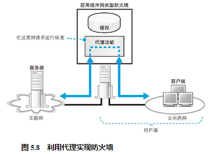

## 如何使用缓存服务器

除了使用多台功能相同的 Web 服务器分担负载之外，还有另外一种方法，就是将整个系统按功能分成不同的服务器 24 ，如 Web 服务器、数据库服务器。缓存服务器就是一种按功能来分担负载的方法。

缓存服务器是一台通过代理机制对数据进行缓存的服务器。代理介于 Web 服务器和客户端之间，具有对 Web 服务器访问进行中转的功能。当进行中转时，它可以将 Web 服务器返回的数据保存在磁盘中，并可以代替 Web 服务器将磁盘中的数据返回给客户端。这种保存的数据称为缓存，缓存服务器指的也就是这样的功能。

## 缓存服务器通过更新时间管理内容

## 最原始的代理——正向代理

实际上，缓存服务器使用的代理机制最早就是放在客户端一侧的，这才是代理的原型，称为正向代理（forward proxy）。

正向代理刚刚出现的时候，其目的之一就是缓存，这个目的和服务器端的缓存服务器相同。不过，当时的正向代理还有另外一个目的，那就是用来实现防火墙。

防火墙的目的是防止来自互联网的非法入侵，而要达到这个目的，最可靠的方法就是阻止互联网和公司内网之间的所有包。不过，这样一来，公司员工就无法上外网了，因此还必须想一个办法让必要的包能够通过，这个办法就是利用代理。简单来说，代理的原理如图 5.8 所示，它会先接收来自客户端的请求消息，然后再转发到互联网中，这样就可以实现只允许通过必要的网络包了。这时，如果能够利用代理的缓存，那么效果就会更好，因为对于以前访问过的数据，可以直接从位于公司内网的代理服务器获得，这比通过低速线路访问互联网要快很多。

此外，由于代理在转发过程中可以查看请求的内容，所以可以根据内容判断是否允许访问。也就是说，通过代理可以禁止员工访问危险的网站，或者是与工作内容无关的网站。包过滤方式的防火墙只能根据 IP 地址和端口号进行判断，因此无法实现这一目的。

在使用正向代理时，一般需要在浏览器的设置窗口中的“代理服务器”一栏中填写正向代理的 IP 地址，浏览器发送请求消息的过程也会发生相应的变化。在没有设置正向代理的情况下，浏览器会根据网址栏中输入的 http://... 字符串判断 Web 服务器的域名，并向其发送请求消息；当设置了正向代理时，浏览器会忽略网址栏的内容，直接将所有请求发送给正向代理。请求消息的内容也会有一些不同。没有正向代理时，浏览器会从网址中提取出 Web 服务器域名后面的文件名或目录名，然后将其作为请求的 URI 进行发送；而有正向代理时，浏览器会像图 5.9 这样，在请求的 URI 字段中填写完整的 http://... 网址。

## 正向代理的改良版——反向代理

## 透明代理

缓存服务器判断转发目标的方法还有一种，那就是查看请求消息的包头部。因为包的 IP 头部中包含接收方 IP 地址，只要知道了这个地址，就知道用户要访问哪台服务器了。这种方法称为透明代理（transparent proxy）。