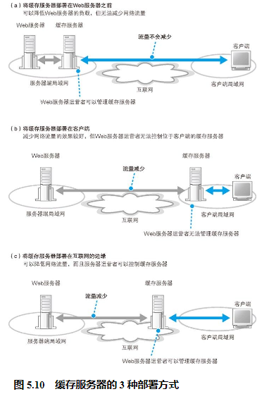

## 利用内容分发服务分担负载

缓存服务器部署在服务器端还是客户端，其效果是有差别的。如图 5.10（a）所示，当缓存服务器放在服务器端时，可以减轻 Web 服务器的负载，但无法减少互联网中的流量。这一点上，将缓存服务器放在客户端更有效（图 5.10（b））。互联网中会存在一些拥塞点，通过这些地方会比较花时间。如果在客户端部署缓存服务器，就可以不受或者少受这些拥塞点的影响，让网络流量更稳定，特别是当访问内容中含有大图片或视频时效果更明显。

不过，客户端的缓存服务器是归客户端网络运营管理者所有的，Web 服务器的运营者无法控制它。比如，某网站的运营者觉得最近网站上增加了很多大容量的内容，因此想要增加缓存服务器的容量。如果缓存放在服务器端，那么网站运营者可以自己通过增加磁盘空间等方式来进行扩容，但对于放在客户端的缓存就无能为力了。进一步说，客户端有没有缓存服务器还不一定呢。

因此，这两种部署缓存服务器的方式各有利弊，但也有一种方式能够集合两者的优点。那就是像图 5.10（c）这样，Web 服务器运营者和网络运营商签约，将可以自己控制的缓存服务器放在客户端的运营商处。

这样一来，我们可以把缓存服务器部署在距离用户很近的地方，同时 Web 服务器运营者还可以控制这些服务器，但这种方式也有问题。对于在互联网上公开的服务器来说，任何地方的人都可以来访问它，因此如果真的要实现这个方式，必须在所有的运营商 POP 中都部署缓存服务器才行，这个数量太大了，非常不现实。

要解决这个问题也有一些办法。首先，我们可以筛选出一些主要的运营商，这样可以减少缓存服务器的数量。尽管这样做可能会导致有些用户访问到缓存服务器还是要经过很长的距离，但总比直接访问 Web 服务器的路径要短多了，因此还是可以产生一定的效果。

接下来这个问题更现实，那就是即便减少了数量，作为一个 Web 服务器运营者，如果自己和这些运营商签约并部署缓存服务器，无论是费用还是精力都是吃不消的。为了解决这个问题，一些专门从事相关服务的厂商出现了，他们来部署缓存服务器，并租借给 Web 服务器运营者。这种服务称为内容分发服务。

## 如何找到最近的缓存服务器

我们可以像正向代理一样在浏览器中进行设置，但用户那么多，也没办法帮所有人去设置浏览器。因此，我们需要一种机制，即便用户不进行任何设置，也能够将请求消息发送到缓存服务器。

这样的方法有几种，下面我们按顺序来介绍。第一个方法是像负载均衡一样用 DNS 服务器来分配访问。也就是说，我们可以在 DNS 服务器返回 Web 服务器 IP 地址时，对返回的内容进行一些加工，使其能够返回距离客户端最近的缓存服务器的 IP 地址。

如果要让用户访问最近的缓存服务器，则不应采用轮询方式，而是应该判断客户端与缓存服务器的距离，并返回距离客户端最近的缓存服务器 IP 地址。这里的关键点不言自明，那就是到底该怎样判断客户端与缓存服务器之间的距离呢？

方法是这样的。首先，作为准备，需要事先从缓存服务器部署地点的路由器收集路由信息（图 5.13）。例如，在图 5.13 的例子中，一共有 4 台缓存服务器，在这 4 台服务器的部署地点又分别有 4 台路由器，则我们需要分别获取这 4 台路由器的路由表，并将 4 张路由表集中到 DNS 服务器上。

接下来，DNS 服务器根据路由表查询从本机到 DNS 查询消息的发送方，也就是客户端 DNS 服务器的路由信息。例如，根据图 5.13 路由器 A 的路由表，可以查出路由器 A 到客户端 DNS 服务器的路由。通过互联网内部的路由表中的路由信息可以知道先通过运营商 X，然后通过运营商 Y，最后到达运营商 Z 这样的信息，通过这样的信息可以大致估算出距离。依次查询所有路由器的路由表之后，我们就可以通过比较找出哪一台路由器距离客户端 DNS 服务器最近。提供路由表的路由器位于缓存服务器的位置，而客户端 DNS 服务器也应该和客户端在同一位置，这样就等于估算出了缓存服务器与客户端之间的距离，从而能够判断出哪台缓存服务器距离客户端最近了。实际上，客户端 DNS 服务器不一定和客户端在同一位置，因此可能无法得出准确的距离，但依然可以达到相当的精度。

## 通过重定向服务器分配访问目标

还有另一个让客户端访问最近的缓存服务器的方法。HTTP 规格中定义了很多头部字段，其中有一个叫作 Location 的字段。当 Web 服务器数据转移到其他服务器时可以使用这个字段，它的意思是“您要访问的数据在另一台服务器上，请访问那台服务器吧。”这种将客户端访问引导到另一台 Web 服务器的操作称为重定向，通过这种方法也可以将访问目标分配到最近的缓存服务器。

当使用重定向告知客户端最近的缓存服务器时，首先需要将重定向服务器注册到 Web 服务器端的 DNS 服务器上。这样一来，客户端会将 HTTP 请求消息发送到重定向服务器上。重定向服务器和刚才一种方法中的 DNS 服务器一样，收集了来自各个路由器的路由信息，并根据这些信息找到最近的缓存服务器，然后将缓存服务器的地址放到 Location 字段中返回响应。这样，客户端就会重新去访问指定的缓存服务器了（图 5.14、图 5.15）。

这种方法的缺点在于增加了 HTTP 消息的交互次数，相应的开销也比较大，但它也有优点。对 DNS 服务器进行扩展的方法是估算客户端 DNS 服务器到缓存服务器之间的距离，因此精度较差；相对而言，重定向的方法是根据客户端发送来的 HTTP 消息的发送方 IP 地址来估算距离的，因此精度较高。

## 缓存的更新方法会影响性能

要改善这一点，有一种方法是让 Web 服务器在原始数据发生更新时，立即通知缓存服务器，使得缓存服务器上的数据一直保持最新状态，这样就不需要每次确认原始数据是否有变化了，而且从第一次访问就可以发挥缓存的效果。内容分发服务采用的缓存服务器就具备这样的功能。

此外，除了事先编写好内容的静态页面之外，还有一些在收到请求后由 CGI 程序生成的动态页面，这种动态页面是不能保存在缓存服务器上的。这种情况下，我们可以不保存整个页面，而是将应用程序生成的部分，也就是每次内容都会发生变化的动态部分，与内容不会发生变化的静态部分分开，只将静态部分保存在缓存中。